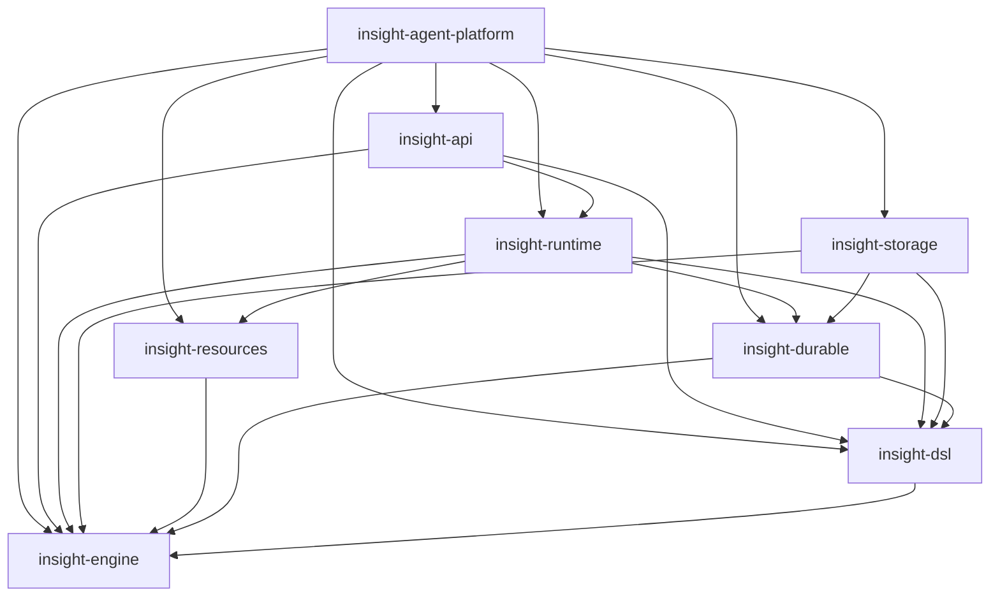

# Rust Workspace 与 Crate 边界拆分规范

| 属性 | 值 |
|---|---|
| 状态 | Implemented / Verified |
| 变更类型 | Internal Architecture / Workspace Cutover |
| 日期 | 2026-07-21 |
| 验证日期 | 2026-07-23 |
| 目标版本 | Repository Layout v1；不改变 `insight.agent/v3` |

## 1. 范围与规范效力

本文定义并记录 `insight-agent-platform` 从单 package 拆分为 Rust workspace 的结构、crate 所有权、
允许的依赖方向、迁移顺序和验收门禁。它只约束实现组织，不重新定义 DSL、Canonical Plan、持久化
状态机、HTTP/SSE、数据库、恢复、Artifact 或资源执行语义。

本文已于 2026-07-23 完成第 11 节全部门禁并进入 `Implemented / Verified` 状态：

1. 根兼容 facade、七个内部 member 及其单向依赖 DAG 是当前实现事实；
2. 第 13 节记录 workspace 已完成的可复核证据；
3. 本文不授权任何行为合同变更；与现行行为规范冲突时，
   [DSL v3 持久化图执行架构规范](./2026-07-18-dsl-v3-durable-graph-execution-design.md)和
   [Response 实时流与 LLM 发布控制规范](./2026-07-19-response-streaming-and-llm-publication-design.md)
   优先；
4. 若方案被放弃或替代，本文必须移入 `docs/archive/specs/`，在归档首页登记放弃/替代原因，并从
   current 索引删除，不能继续造成已实施假象。

### 1.1 规范性术语

- **必须**：实现和 CI 都必须满足；
- **不得**：明确禁止；
- **应**：除非另有被评审接受的设计记录，否则必须满足；
- **可以**：不改变本文不变量时允许的实现选择；
- **package**：Cargo manifest 定义的发布/构建单元；
- **crate**：package 中的 Rust 编译单元。本文定义的每个内部 library package 只提供一个同名
  library crate；
- **根 facade**：继续使用 `insight-agent-platform` package 名的兼容 library；
- **composition root**：选择具体存储、资源、broker、Artifact 和 HTTP adapter 并启动进程的根 binary。

本次迁移是代码布局的 clean cutover：允许根 facade 重导出同一个类型，但不得同时保留两份实现、
old/new layout feature 或双写路径。

## 2. 迁移前基线与问题证据

### 2.1 迁移前单 crate 基线

在 2026-07-21 的 Phase 0 基线中，根 `Cargo.toml` 只有一个 `publish = false` package，同时提供：

- library `insight_agent_platform`；
- binary `insight-agent-platform`；
- 45 个 integration-test target。

迁移前根 manifest 没有 `[workspace]` 和 `[features]`。27 个普通依赖全部为 mandatory，Axum、Reqwest、
SQLx 的 SQLite/PostgreSQL 支持、DSL parser、运行时和配置实现都进入同一个编译单元。

迁移前 Rust 源码规模如下；数字用于说明变更半径，不作为 crate 拆分阈值：

| 范围 | Rust 行数（约） |
|---|---:|
| `src/` | 182,522 |
| `src/engine/` | 143,995 |
| `src/engine/repository/` | 99,347 |
| `src/engine/plan/` + `src/engine/scheduler/` | 19,654 |
| `src/dsl/` | 11,800 |
| `src/runtime/` | 13,994 |
| `tests/` | 50,215 |

### 2.2 迁移前目录不是可直接搬迁的 crate 边界

| 耦合 | 迁移前证据 | 问题 |
|---|---|---|
| DSL → SQL store | `src/dsl/v3/graph_repository.rs` 同时定义 Graph port、`VersionedPlan` 构造逻辑和 SQLite/PostgreSQL SQLx 实现 | DSL 无法独立编译，作者模型与基础设施混合 |
| engine → repository | `src/engine/artifact_store.rs` 使用 `RepositoryError`/`StorageLocator`；`src/engine/worker.rs` 使用 `ModelToolTaskClaim` | engine 不是下层合同内核 |
| repository → runtime | repository 的 terminal snapshot、tool/retrieval publication 和 `scheduler_runtime.rs` 使用 `runtime::Workflow*` 与 live broker 类型 | repository 与 runtime 形成反向依赖 |
| runtime → repository/SQL | `src/runtime/v3_service.rs` 使用大量 repository trait，并直接使用 `sqlx::Row`；它还为两个具体 repository 实现应用层 trait | 服务编排、port 和 adapter 所有权倒置 |
| engine adapter → 上层 | `src/engine/leaf_adapters.rs` 同时依赖 catalog、DSL、resources、runtime | `engine` 同时承担合同和生产装配 |
| resources → DSL/runtime | Action、Model、Retrieval 合同使用 `dsl::CompileError` 与 `runtime::{RunError, ExecutionControl}` | 资源 SPI 不能作为独立下层依赖 |
| runtime → SQL live transport | `src/runtime/postgres_response_broker.rs` 直接使用 SQLx | runtime 无法只依赖抽象 port |

Phase 0 基线中 `src/engine/repository/scheduler_runtime.rs` 的文件说明本身将其定义为 production
orchestration；它不是 SQL repository adapter。`src/dsl/v3/graph_repository.rs` 中为 `VersionedPlan`
添加的 inherent impl 在
类型移入另一 crate 后也不再合法，必须改由类型所有者提供构造函数或由 runtime/catalog 提供显式
builder。

### 2.3 迁移前结构的实际成本

1. Cargo 无法强制 scheduler、DSL、HTTP 和数据库之间的依赖方向。
2. 修改公共 DTO、DSL 或资源合同会触发接近全仓库的重新编译和测试。
3. repository、runtime 和 adapter 的评审所有权重叠，无法通过 manifest 看出越层依赖。
4. SQLite/PostgreSQL、真实进程、Graph 和 response-stream 测试都依赖同一个根 facade，局部变更的
   最小验收面不明确。
5. 迁移前 CI 脚本只扫描根 `src/` 与根 `Cargo.toml`；直接移动到 `crates/*` 会造成门禁“绿色但失效”。

## 3. 目标、非目标与全局不变量

### 3.1 目标

1. 建立 Cargo 可验证的单向依赖 DAG，禁止 engine/durable 反向依赖 runtime/API/SQL adapter。
2. 让 Plan、scheduler、状态机、worker/public 合同可以在不编译 Axum、SQLx、Reqwest 的情况下验证。
3. 让 runtime 只消费 durable、Artifact 和 live-response ports，由根进程注入具体 adapter。
4. 将 SQLx、migration、数据库方言、文件系统 Artifact 与 PostgreSQL live transport 集中到 storage。
5. 将作者语法、资源 SPI、运行编排、HTTP transport 分成独立所有权边界。
6. 保留根 package、binary 名、常用 Rust 导入路径和 `cargo run` 体验，避免一次性机械改写所有消费者。
7. 让每个 crate 有独立的单元/合同测试，同时保留跨 crate 的生产级 conformance tests。
8. 迁移过程中每个阶段只有一个权威实现，并且完整 workspace 始终可构建、可回退。

### 3.2 非目标

- 不改变 `insight.agent/v3` 作者语法、Plan wire、语义哈希或 verifier 行为；
- 不改变 HTTP 路由、请求/响应 JSON、SSE event、认证、错误 code 或 binary 名；
- 不增加、删除或重写 durable migration，不改变 SQL bytes、顺序或 checksum；
- 不改变 SQLite 单进程与 PostgreSQL 生产语义；
- 不在同一变更中升级 Rust edition、第三方 major version 或清理 SQLx feature；
- 不引入 old/new engine、repository 或 scheduler feature；
- 第一轮不把 SQLite 与 PostgreSQL 再拆成两个 package，也不把 OpenAI/HTTP provider 拆成 nano-crate；
- 不以任意 LOC 上限驱动 crate 数量；
- 不承诺内部 crate 可独立发布，所有 workspace member 继续 `publish = false`。

### 3.3 全局不变量

1. 每个领域类型只能有一个定义；兼容层必须使用 `pub use`，不得复制 struct/enum 或用 newtype
   模拟旧类型。
2. 根 package 之外的内部 crate 不得依赖 `insight-agent-platform` facade。
3. Cargo normal-dependency 图必须符合第 5 节；dev-dependency 不得被用来绕过生产边界。
4. `PLAN_WIRE_VERSION`、Plan semantic hash、execution/public event schema version、
   `response-stream/v1` 与 migration checksum 必须保持不变。
5. SQLite 与 PostgreSQL 必须继续实现同一组 durable ports，并通过共享合同测试。
6. scheduler 只根据 Plan 和事实作决策；crate 搬迁不得引入 clock、network、filesystem 或 repository
   调用到 planner。
7. runtime 不得通过 downcast 或匹配具体 SQLite/PostgreSQL 类型取得能力。
8. composition root 必须显式选择并注入 repository、Artifact store、live broker 和 worker registry。
9. 路径迁移不得让 cutover、migration、PostgreSQL、real-process 或 binary smoke 门禁静默跳过。

## 4. Workspace 与 Package 所有权

### 4.1 Workspace 形态

根 manifest 同时保留 `[package]` 并增加 `[workspace]`，不是 virtual workspace：

```toml
[workspace]
members = [
  ".",
  "crates/engine",
  "crates/dsl",
  "crates/durable",
  "crates/resources",
  "crates/storage",
  "crates/runtime",
  "crates/api",
]
default-members = ["."]
resolver = "2"

[workspace.package]
edition = "2021"
rust-version = "1.94.1"

[workspace.dependencies]
# 统一第三方版本与内部 path dependency；各 member 只声明实际使用的依赖。
```

成员必须显式列出，避免新目录无意进入生产 workspace。`cargo run` 继续默认运行根 package；CI 和完整
验证必须显式使用 `--workspace`。

### 4.2 Package 清单

| Package / Rust crate | 所有权 | 迁移前主要来源 | 明确禁止 |
|---|---|---|---|
| `insight-engine` / `insight_engine` | 无 I/O 的执行合同内核：identity、value、Plan、纯 scheduler、状态机、aggregate、control、event、recovery、worker request/result、共享脱敏诊断类型、公开 response/history/outcome DTO、公开资源 policy、Schema 安全策略、Artifact/live-response ports 与共享有界队列原语 | `src/engine/` 中除 repository、具体 Artifact/leaf adapter 外的领域代码；`src/dsl/mod.rs` 的 path/span/`CompileError`；repository 的纯 `RepositoryError`；`src/runtime/control.rs`；`runtime/response_stream` 的 wire/port/queue 部分；`src/events`、`history`、`outcome`、`schema.rs` | SQLx、Axum、Reqwest、环境变量、文件系统、具体 broker/store/provider、catalog、DSL parser |
| `insight-dsl` / `insight_dsl` | DSL v3 raw/AST/validate/compiler/template/Graph authoring、诊断与无 SQL 的 Graph store port | `src/dsl/`，但排除 `graph_repository.rs` 的 SQL 实现和外部类型 inherent impl | SQLx、Axum、Reqwest、runtime、storage、具体 repository |
| `insight-durable` / `insight_durable` | 后端中立的 durable ports、commands、claims、receipts、projection/publication models；保留既有 production repository 聚合合同；兼容重导出 engine-owned `RepositoryError` | `src/engine/repository/` 中的 trait/model/command 文件，以及 `runtime::ProductionRunRepository` 的原始合同定义 | SQLx、migration SQL、SQLite/PostgreSQL 类型、scheduler pump、live broker 实现、Axum、Reqwest |
| `insight-resources` / `insight_resources` | Model/Action/Retrieval SPI、descriptor、registry、OpenAI 与 builtin provider 实现；使用 engine-owned `CompileError` 并保留现有签名；拥有 provider 私有观测辅助 | `src/resources/` 与 `src/observability.rs`；资源配置加载移至根 composition | durable/storage/runtime/API、SQLx、Axum |
| `insight-storage` / `insight_storage` | SQLite/PostgreSQL durable adapter、共享 SQL codec、migration manifest、Graph SQL 实现、本地/共享文件系统 Artifact store、PostgreSQL live broker | `repository/{sqlite*,postgres*,common,migration_manifest}`、Graph SQL 代码、`engine/artifact_store.rs` 的文件系统实现、`runtime/postgres_response_broker.rs` | Axum、Reqwest、catalog、RunService、scheduler/worker pump、资源 registry |
| `insight-runtime` / `insight_runtime` | catalog/deployment link、production leaf/retrieval adapter、scheduler/worker pump、RunService、进程内 live broker 和运行生命周期编排 | `src/catalog_v3.rs`、`engine/{leaf_adapters,retrieval_adapter}`、`repository/scheduler_runtime.rs`、`src/runtime/` 中非 PostgreSQL adapter 代码 | SQLx、Axum、具体 SQLite/PostgreSQL repository 构造、平台配置解析 |
| `insight-api` / `insight_api` | Axum router、认证、请求/错误映射和 SSE transport | `src/api/formal/` | SQLx、Reqwest、具体 storage/provider、进程启动、环境变量 |
| `insight-agent-platform` / `insight_agent_platform` | 根兼容 facade、Platform/Resource 配置、严格 YAML 配置解码、进程级 tracing 初始化、binary composition | `src/{lib,main,config,yaml}.rs` 与 `resources/config.rs` | 新的领域状态机、SQL transaction、scheduler 决策、provider 业务实现 |

`insight-engine` 中“无 I/O”表示不得进行网络、数据库、文件系统、进程或环境访问；它可以为 async port、
取消和 deadline 合同使用最小 Tokio/`tokio-util` primitives。未来是否把 model、scheduler 或 public
contracts 再拆 package，必须由独立设计和编译数据决定，不属于本次 cutover。

### 4.3 物理结构

```text
Cargo.toml                    # root package + workspace
src/                          # facade、config、binary composition
crates/
  engine/
  dsl/
  durable/
  resources/
  storage/
  runtime/
  api/
agents/                       # 保持 workspace root 运行资产
config/
migrations/durable_v3/
schemas/vendor/
tests/fixtures/
```

`agents/`、`config/`、`data/`、`migrations/`、`schemas/` 与共享 fixtures 在第一轮保持根路径不变，避免
把代码布局变更扩展为部署资产布局变更。

## 5. 允许的依赖 DAG

### 5.1 唯一允许方向

下图箭头表示“consumer 直接依赖 dependency”：



精确边同样列为：

```text
  dsl       -> engine
  durable   -> engine + dsl
  resources -> engine
  storage   -> engine + durable + dsl
  runtime   -> engine + durable + dsl + resources
  api       -> engine + dsl + runtime
  root      -> engine + dsl + durable + resources + storage + runtime + api
```

图中的 root 是最高层 composition root。`storage` 与 `runtime` 之间不得存在直接依赖：二者通过
`engine`/`durable` 所有的 ports 组合。

### 5.2 内部依赖矩阵

| Consumer | 可以直接依赖 |
|---|---|
| `engine` | 无内部 crate |
| `dsl` | `engine` |
| `durable` | `engine`, `dsl` |
| `resources` | `engine` |
| `storage` | `engine`, `durable`, `dsl` |
| `runtime` | `engine`, `durable`, `dsl`, `resources` |
| `api` | `engine`, `dsl`, `runtime` |
| root | 全部内部 crate |

没有列出的 normal/dev/build dependency 均禁止。`durable -> dsl` 只服务于保留既有
`ProductionRunRepository: GraphSurfaceRepository` 聚合合同；durable 的原子 ports、commands 与 models
不得引用 DSL 类型。测试共享代码应放在被测 crate 的 `tests/support` 或根 integration harness；不得让
下层 crate dev-depend root facade。

### 5.3 外部依赖门禁

| Crate | 主要允许依赖（非穷举） | 必须缺席的直接依赖 |
|---|---|---|
| `engine` | Serde、Chrono、CEL、Regex、JSON Schema、hash/ID、最小 async/cancellation primitives | `sqlx`, `axum`, `reqwest`, `dotenvy`, `tracing-subscriber`, YAML config parser |
| `dsl` | Serde、YAML parser、Handlebars、hash | `sqlx`, `axum`, `reqwest` |
| `durable` | async trait、Serde、Chrono | `sqlx`, `axum`, `reqwest` |
| `resources` | Reqwest、Tokio、Serde、Chrono/chrono-tz | `sqlx`, `axum` |
| `storage` | SQLx、Tokio、hash/filesystem primitives | `axum`, `reqwest` |
| `runtime` | Tokio、Futures、Tracing、UUID | `sqlx`, `axum`, `reqwest`（允许经 resources 的传递依赖，但源码和 manifest 不得直接使用） |
| `api` | Axum、Tokio stream、Serde | `sqlx`, `reqwest` |

依赖版本必须在 `[workspace.dependencies]` 统一，member 只通过 `workspace = true` 选择实际使用项。
不允许为了通过边界检查给依赖改名或从 root facade 间接访问。

manifest 检查不足以证明“无 I/O”。boundary gate 还必须扫描 production source 与 `build.rs`：engine、
dsl、durable 不得使用 `std::{fs,env,net,process}`、`tokio::{fs,net,process}` 等 I/O API；纯 scheduler
模块还必须禁止 `Utc::now()`、`Instant::now()` 及等价隐式 clock。上述下层 crate 默认不得有 `build.rs`；
新增 build script 必须先修改本规范并接受安全评审。

## 6. Port、DTO 与实现所有权

### 6.1 权威所有权表

| 合同 | 定义 crate | 实现/适配 crate |
|---|---|---|
| `Plan`、ID、state、scheduler facts/actions | `engine` | DSL 生成；runtime 调用；storage 持久化 |
| `CompileError`、author path/span、纯 `RepositoryError` | `engine` | DSL/durable 从旧路径兼容重导出；resources 保持既有返回签名；storage 映射具体 I/O error |
| `TaskExecutionRequest/Result`、`LeafTaskExecutor` | `engine` | production leaf/retrieval executor 在 `runtime`；Model/Action/Retrieval provider 在 `resources` |
| `ExecutionControl`、`RunError`、`StopReason` | `engine` | runtime 建立 deadline/cancel；resources 消费 |
| response-stream/public tool/retrieval DTO | `engine` | runtime 发布；storage 持久化；API 序列化 |
| `DurableResponseSnapshot`、terminal/usage kind、HumanTask 查询 DTO | `engine` | durable port 引用；storage 装载；runtime 映射；API 序列化 |
| `ToolPublicPolicy`、`RetrievalPublicPolicy` 及有界 public projection policy | `engine` | resources descriptor 使用并可兼容重导出；runtime 执行投影 |
| `LiveResponseBroker` port | `engine` | in-memory 实现在 `runtime`；PostgreSQL 实现在 `storage` |
| bounded live-response queue/order primitive | `engine` | runtime in-memory broker 与 storage PostgreSQL broker 共同组合 |
| Artifact object-store port、`ArtifactRef`、opaque locator/error | `engine` | filesystem 实现在 `storage`；durable metadata port 在 `durable` |
| `DurableRepository` 及子能力、commands/receipts/claims | `durable` | SQLite/PostgreSQL 实现在 `storage` |
| `ProductionRunRepository` 聚合合同、`RunRepositoryCapability`、`PendingMigrationWait`（含既有 `GraphSurfaceRepository` supertrait） | `durable` | 原始 trait 与伴随 DTO 定义完整迁移；具体 repository 类型在 `storage` 实现；runtime 从旧路径重导出并消费 trait object |
| Graph author DTO 与 `GraphSurfaceRepository` port | `dsl` | SQLite/PostgreSQL 实现在 `storage` |
| Resource SPI、descriptor、registry | `resources` | 使用 engine-owned `CompileError` 保持签名；builtin/OpenAI provider 暂同 crate；runtime 负责链接与 worker 适配 |
| catalog、deployment resolver、worker registry 组装 | `runtime` | root 提供配置和具体 registry 实例 |
| HTTP/SSE transport | `api` | root 传入 `RunService` 与认证配置 |

port 应使用 owner 定义的错误；多个下层 port 共享且已有兼容承诺的脱敏错误由最低公共依赖 `engine`
所有。adapter 可以在边界映射错误，但不得把 `sqlx::Error`、`reqwest::Error` 或 Axum rejection 放入
engine/durable 的公开签名。`dsl::CompileError` 与 `engine::repository::RepositoryError` 旧 facade 路径
必须重导出 engine 中的同一个原始类型，不得使用行为不同的 wrapper。

迁移中的跨 crate 调用会迫使一部分 Phase 0 `pub(crate)` 项提升为 `pub`。这种可见性只表示 workspace-internal
adapter API：必须放在明确的 `adapter`/`internal` 模块、默认 `#[doc(hidden)]`，且不得自动从根 facade
重导出。只有第 7.1 节 facade compatibility inventory 中的表面承担 Rust 路径兼容承诺。

### 6.2 必须先解除的循环

#### A. repository ↔ runtime public projection

`WorkflowToolPublicProjection`、`WorkflowRetrievalPublicProjection`、terminal response DTO 和 live
publication identity 必须从 runtime 下沉到 `engine`。它们是跨 worker、storage、runtime、API 的稳定
合同，不是 broker 实现。

`response_stream.rs` 必须拆为：

- `engine::response`：wire DTO、验证、顺序 identity、broker port，以及不执行 I/O 的有界 queue/order
  primitive；
- `runtime`：in-memory queue/subscriber 实现和 orchestration；
- `storage`：PostgreSQL NOTIFY adapter。

Phase 0 PostgreSQL broker 复用的 `RunQueue` 不得留在 runtime 后再由 storage 反向引用。该共享有界队列
必须以 engine-owned primitive 形式下沉，或由两个 adapter 各自组合同一个 engine state machine；不得
复制两套背压、gap、seal 或 byte-limit 算法。

Phase 0 projector 使用的 `ToolPublicPolicy`、`RetrievalPublicPolicy` 等跨层 policy 类型同样必须由
`engine` 所有，resources 使用并可从旧路径兼容重导出。`FrozenRetrievalTarget::validate_registered`
这类依赖 `RegisteredRetrieval` 的校验必须移为 runtime adapter free function；engine 只保留冻结且可序列化
的 target/policy 合同，禁止形成 `engine -> resources -> engine`。

#### B. resources → DSL/runtime

`CompileError`、`DslPath` 与 `SourceSpan` 的原始定义必须下沉到 `engine` 的通用 author/deployment
diagnostics；DSL 从原路径重导出同一类型，resources 继续返回它，从而既消除 `resources -> dsl` 又保留
现有公开签名。catalog 可以附加 deployment diagnostic；迁移前后的 error code、classification、脱敏
message 与 fail-closed 行为必须相同。

`RunError`、`RunErrorKind`、`ExecutionControl`、`Stop*` 必须移到 `engine`，因为它们是 worker-facing
execution contract；resources 不得依赖 runtime。

#### C. engine worker → durable claim

`engine::worker` 不得接受 `durable::ModelToolTaskClaim`。durable claim 保留 lease/fence/persistence
authority；runtime 从 claim 构造 engine-owned 的不可变 worker request，并在完成后映射回 durable
outcome。不得把完整 repository claim 作为“方便的共享 DTO”下沉到 engine。

#### D. DSL Graph → SQL

Graph DTO、edit/reducer 和 Graph store port 保留在 `dsl`。port 继续返回 engine-owned、durable 兼容
重导出的同一个 `RepositoryError`，从而保留 trait 签名且不引入 `dsl -> durable`。所有 row decode、
query、SQLx error mapping 和两个具体 repository impl 移到 `storage`。

`VersionedPlan` 所在的 `durable` crate 只提供不依赖 DSL 类型的通用验证构造入口；Graph-specific
组装必须改为 runtime/catalog 中的显式 free function 或 builder。`VersionedPlan` 与 durable 原子
ports/models 不得引用 DSL 类型；仅允许 F 节为保留
`ProductionRunRepository: GraphSurfaceRepository` 而存在的声明性兼容依赖，且不得扩散到其他 durable
模块。不得跨 crate 添加 inherent impl。

#### E. repository scheduler runtime → runtime

`drive_scheduler_*`、worker pump、failure policy freeze、live observer 和 Artifact staging orchestration
移到 `runtime`。`durable` 只定义需要的读取/提交 port，`storage` 只实现事务。

任何 `Utc::now()`、spawn、retry sleep、worker 调用或 broker publish 都不得藏在 durable port 定义中。
数据库事务可以使用数据库时间，但它属于 storage adapter 实现。

#### F. runtime service → 具体 SQL

`v3_service.rs` 中的 `sqlx::Row`、直接 query、PostgreSQL listener 和为具体 backend 编写的 impl 必须移到
`storage`。`ProductionRunRepository` 由 `durable` 所有，并在 `storage` 的具体类型一侧实现，避免
orphan-rule 问题和 runtime 对 backend 类型的认知。

Phase 0 公开的 `runtime::ProductionRunRepository` 已把 DSL-owned `GraphSurfaceRepository` 放入 supertrait，且
仓库消费者会通过该 bound 调用 Graph 方法。只保留同名路径、却删除这个 supertrait 或改成新的 blanket
trait，会破坏下游实现和泛型调用，因此目标必须把**原始 trait 定义完整迁移**到 `durable`：

- `ProductionRunRepository` 的名称、方法、默认实现、supertraits 和 object-safe 行为必须保持不变；
- 这是唯一允许的 `durable -> dsl` 生产依赖；durable 的原子 ports 不得因此引用 DSL 类型；
- runtime 从原路径重导出同一个 trait，并继续消费 `Arc<dyn ProductionRunRepository>`；
- storage 在具体 repository 类型一侧实现该 trait 及其 Graph supertrait，无需依赖 runtime；
- 不得以 `ProductionDurableRepository`/`RuntimeRepository` 替换公开 trait，也不得用 facade alias 掩盖
  supertrait 或公开 impl 的变化。

#### G. API → 根配置

`api/v1/auth.rs` 不得继续引用根 `config::AuthConfig`。API 只拥有 transport-facing `ApiAuth` 与
principal resolver；root composition 根据 `PlatformConfig` 显式构造 `ApiAuth`。这样 API 不依赖根
package，配置 schema 也不会成为 HTTP crate 的底层合同。

Phase 0 API 直接使用的 `HumanWorkItem`、`DurableResponseSnapshot`、`ResponseTerminalKind` 与 usage/terminal
相关只读 DTO 必须移到 `engine` 的公共合同；HumanTask commands/receipts 和 snapshot repository port
仍由 `durable` 所有。API 不得为了复用这些 DTO 增加 `api -> durable` 边。

#### H. 根配置 → SQLx

Phase 0 `src/config.rs` 使用 `sqlx::postgres::{PgConnectOptions, PgSslMode}` 验证 PostgreSQL URL/TLS policy。
SQLx-specific 解析 helper 必须移到 `storage`，root 只持有脱敏 connection string/config 并把 storage
错误映射为原有 `PlatformConfigError`。完成 Phase 4 后，根 production `[dependencies]` 和非测试源码
不得直接使用 SQLx；根 PostgreSQL E2E 可以保留 SQLx `dev-dependency`。

## 7. 兼容 Facade 与资产路径

### 7.1 根 Rust API

根 `src/lib.rs` 必须退化为兼容 facade。Phase 0 必须冻结完整的 public Rust path inventory，并用
compile/API-snapshot gate 验证迁移前后等价。facade 可以用本地 module shim 将多个 member 的同一类型
组合回旧路径；inventory 至少包含以下示例：

```text
insight_agent_platform::engine::Plan
insight_agent_platform::engine::repository::DurableRepository
insight_agent_platform::engine::repository::SqliteDurableRepository
insight_agent_platform::dsl::v3::compile_source
insight_agent_platform::resources::models::ChatModel
insight_agent_platform::runtime::RunService
insight_agent_platform::api::v1::build_router
```

facade 只能重导出，不能包含状态机、SQL、adapter 或 wrapper。内部 member 必须使用直接 crate 路径，
不得经 facade 形成隐藏反向依赖。除已明确采用的 API breaking rename
`api::formal::FormalApiState` → `api::v1::ApiState` 外，本规范承诺保留 Phase 0 inventory 中的全部路径，
而不只是上面的示例；删除其他路径属于未来独立 breaking design，本规范不授权删除。
当前 `src/lib.rs` 暴露的 `api`、`catalog_v3`、`config`、`dsl`、`engine`、`events`、`history`、`outcome`、
`resources`、`runtime`、`schema` 顶层路径都必须保留；其中跨 member 的旧嵌套路径可由 facade module
shim 组合，但仍只能指向唯一原始类型。

### 7.2 Binary 与运行配置

- package 和 binary 名继续为 `insight-agent-platform`；
- `PLATFORM_CONFIG`、全部环境变量、默认相对路径和 Quickstart 命令保持不变；
- `src/main.rs` 保持 composition root，选择 `SqliteDurableRepository` 或
  `PostgresDurableRepository`、Artifact store、live broker、resources、runtime 和 API；
- `tests/binary_smoke.rs` 必须留在拥有该 binary target 的根 package，以保留
  `CARGO_BIN_EXE_insight-agent-platform`。

### 7.3 Migration 与 vendor snapshot

`migrations/durable_v3/{sqlite,postgres}` 的 23 对文件继续保留在 workspace root。storage 的 manifest
必须通过以自身 `CARGO_MANIFEST_DIR` 为基准、可由编译器验证存在的固定路径嵌入这些 SQL。不得复制
第二份 migration 目录。

迁移前后必须逐项证明：

1. 文件名、版本、顺序和 SQL bytes 相同；
2. PostgreSQL checksum 相同；
3. SQLite guard 相同；
4. manifest 数量与磁盘两个目录都严格一致；
5. production repository 实际迭代同一 manifest。

`schemas/vendor/openai-responses-streaming-2026-07-19.snapshot.json` 与共享 fixtures 同样留在根目录。
移动内联测试后必须使用统一的 workspace asset helper，禁止依赖偶然的 `../..` 深度而没有存在性门禁。

### 7.4 Feature 与发布策略

- 所有 member `publish = false`；
- 第一轮不增加内部 crate feature matrix，当前 binary 继续同时构建 SQLite 与 PostgreSQL 能力；
- 语义能力不得用 Cargo feature 表达；
- 禁止 `old_layout`、`new_layout`、`legacy_*`、`v3_scheduler` 等切换 feature；
- SQLx feature 清理、backend-only build 和 provider package 二次拆分必须另行评审。

## 8. 分阶段 Clean Cutover

每一阶段必须独立通过第 9.2 节命令和第 10 节验证；类型和实现使用 `git mv`/单一定义迁移，不维护
并行副本。

### Phase 0：先修门禁，不移动生产代码

1. 修改 `scripts/check-v3-cutover-residuals.sh`，让 production source scan 覆盖根 `src/` 与所有
   workspace member `src/`，Cargo feature scan 覆盖所有 member manifests；deleted implementation
   path 检查必须按新 owner 路径同步扩展，禁止历史实现换到 `crates/*` 后复活。
2. 新增 `scripts/check-crate-boundaries.sh`：用
   `cargo metadata --locked --all-features --format-version 1` 的完整 resolve graph 校验第 5.2 节内部边、
   normal/dev/build 边种类，以及 engine/dsl/durable 到 Axum、SQLx、Reqwest 的传递不可达性；并检查
   第 5.3 节禁止的直接依赖、I/O/clock source import 和下层 `build.rs`。
3. 记录 `cargo tree --locked --workspace --all-features -e features` 人类可读基线，并从完整 metadata
   生成版本固定、排序稳定的第三方 `(name, version, enabled features)` snapshot。boundary script 必须在
   每阶段和最终 CI 比较该 snapshot，至少逐项冻结 SQLx、Tokio、Axum、Reqwest 的 feature 集；
   `Cargo.lock` 不足以证明启用 feature 未改变。
4. 记录 Phase 0 Plan/response/event JSON golden、migration checksum，并冻结完整根 facade public API
   inventory/compile snapshot。snapshot 必须覆盖路径、函数签名、trait supertraits/关联项、公开 trait impl
   与典型下游 impl compile fixture；所用工具与版本必须固定且能在 CI 重放。
5. 识别并修复源码路径型测试：
   - `tests/v3_scheduler_core.rs` 的 `#[path = "../src/engine/scheduler/mod.rs"]`；
   - `tests/v3_repository_postgres_contract.rs` 的源码 `include_str!`；
   - `tests/v3_artifact_repository.rs` 的源码 `include_str!`；
   - `tests/v3_migration_layout.rs` 对 `public_outbox.rs` 的源码 `include_str!`。

源码字符串断言应改为行为、数据库约束或独立 architecture gate；不得只更新相对路径继续把私有实现
文本当作长期合同。

退出条件：旧单 crate 全门禁通过，且 future `crates/*/src` 不会逃过扫描。

### Phase 1：建立 hybrid workspace

1. 增加七个 `publish = false` member 和显式 workspace 配置。
2. 将 edition、`rust-version` 和第三方版本移到 workspace 级；不升级版本、不改变 feature。
3. 根 package、lib、bin 和全部 integration tests 保持可用。
4. CI 的 clippy/test 命令增加 `--workspace`。

退出条件：`cargo metadata --locked --format-version 1 --no-deps` 只出现预期八个 package，完整
workspace 与旧 binary smoke 通过。

### Phase 2：抽取 `insight-engine` 合同内核

按第 6 节先下沉 public DTO、execution control、Artifact/live ports，再移动 Plan、scheduler、state、event、
worker contracts。移出或反转所有对 repository/resources/runtime 的引用。

根 `engine` shim 在同一阶段重导出原类型。不得用新旧类型之间的 serde round-trip 作为兼容层。

退出条件：`cargo check -p insight-engine` 的 normal dependency tree 不含 SQLx、Axum、Reqwest；纯 Plan、
scheduler、state、public protocol 测试直接面向 `insight_engine` 通过。

### Phase 3：抽取 DSL、durable ports 与 resources

1. 移动 DSL parser/AST/compiler/Graph；把 Graph SQL 部分留在待迁 storage adapter。
2. 拆分并移动 repository traits/commands/models；`scheduler_runtime` 不进入 durable。迁移前
   `artifact.rs`、`human_task.rs`、`ingress.rs`、`public_outbox.rs` 等同时包含 port 与 SQLx impl 的文件
   必须拆成 durable contract 和 storage adapter 两部分，不能整文件搬迁；原始
   `ProductionRunRepository` 及其 `RunRepositoryCapability`、`PendingMigrationWait` 伴随类型按第 6.2F 节
   一并迁入 durable。
3. resources 直接使用 engine-owned error/control 原始类型，删除对 DSL/runtime/durable 的引用；不得定义
   wrapper、type duplicate 或行为不同的本地错误。
4. `CompileError` 与 `RepositoryError` 的纯原始类型进入 engine，DSL/durable 从旧路径重导出；
   `sqlx::Error` 分类/映射留给 storage。`common.rs` 中纯 canonicalization/model helper 进入 durable，
   row/SQL codec 留给 storage。
5. 根 facade 持续重导出旧路径。

退出条件：三个 member 的 manifest 符合第 5 节；DSL 编译 fixtures、durable model tests 和 resource
registry/provider tests 分别通过。

### Phase 4：抽取 `insight-storage`

1. 移动 Phase 3 拆出的 SQLite/PostgreSQL adapter 实现与共享 SQL codec；第一轮不拆 backend package。
2. 移动 migration manifest、Graph SQL impl、filesystem Artifact store 和 PostgreSQL live broker。
3. 将具体 backend 的 `ProductionRunRepository`、Graph、Artifact 和 broker impl 放在具体类型一侧。
4. 移入 Phase 0 根配置使用的 PostgreSQL URL/TLS SQLx helper，保持相同的验证时机、error code 与脱敏。
5. 保持 migration 与 vendor assets 的根路径和字节不变。

退出条件：storage 是唯一以 normal dependency 直接依赖 SQLx 的内部 library，根仅可在 E2E
dev-dependency 使用 SQLx；SQLite、真实 PostgreSQL 16、migration、Artifact、Graph repository 和
PostgreSQL broker 合同测试通过。

### Phase 5：抽取 runtime 与 API，收敛根 package

1. 将 catalog、leaf/retrieval adapters、scheduler/worker pump、RunService 和 in-memory broker 移到 runtime。
2. 将 Axum/auth/SSE 移到 API，并在 root composition 显式完成 `PlatformConfig` 到 `ApiAuth` 的映射；
   既有 `From<&AuthConfig> for ApiAuth` 公开 impl 必须作为 root-owned compatibility impl 保留。
3. 把 SQL 查询和具体 backend 判断从 runtime 完全移除。
4. 根 package 只保留配置、进程级 tracing/bootstrap、facade 和 composition root；provider 私有
   observability helper 随 resources 迁移。

退出条件：runtime/API 的直接依赖符合第 5 节；重放 Phase 0 完整 compile/API snapshot（包括 trait
supertraits、关联项和公开 impl）以及所有 HTTP/SSE/binary 测试并通过。

### Phase 6：测试归属、文档与状态切换

1. 将 crate-local 测试迁到其 owner；跨层 E2E 与 binary smoke 保留根 package。
2. 更新根 `README.md` 与 `docs/current/development.md` 的 workspace 验证命令和代码导航。
3. 更新 architecture 文档中的代码边界，不改变运行语义。
4. 删除迁移期临时 module shim，只保留本规范承诺的根 facade 重导出；删除后再次重放完整 compile/API
   snapshot。
5. 完成第 11 节证据后，将本文状态改为 `Implemented / Verified`。

## 9. 测试所有权与 CI 治理

### 9.1 测试归属

| Owner | 测试范围 |
|---|---|
| `engine` | Plan model/schema、semantic hash、state/aggregate/control、纯 scheduler、worker/public DTO 验证 |
| `dsl` | raw/AST/compiler、positive/negative fixtures、Graph author/edit/reducer |
| `durable` | command/receipt/claim 构造、port 默认行为、serialization 与 invariant |
| `resources` | registry、descriptor hash、OpenAI protocol parser、builtin Action/Retrieval |
| `storage` | SQLite/PostgreSQL、migration、projection/recovery、Artifact、Graph SQL、PG broker、安全竞态 |
| `runtime` | scheduler/worker pump、catalog/deployment、production lifecycle、recovery、tool continuation、live response |
| `api` | formal HTTP、auth、错误映射、SSE wire |
| root | PlatformConfig、完整 production E2E、real-process restart/shutdown、secret noninterference、binary smoke |

测试可以暂时从根 facade 消费以降低单阶段改写量，但 Phase 6 结束时 crate-local 测试必须直接导入 owner
crate。根 E2E 可以继续通过 facade 验证兼容面。

### 9.2 CI 命令

完成 workspace 化后，最低门禁为：

```bash
bash scripts/check-v3-cutover-residuals.sh
bash scripts/check-crate-boundaries.sh
cargo fmt --all -- --check
cargo metadata --locked --all-features --format-version 1
cargo check --locked --workspace --all-targets --all-features
cargo clippy --locked --workspace --all-targets --all-features -- -D warnings
cargo test --locked --workspace --all-targets --all-features
cargo test --locked --workspace --doc --all-features
cargo audit
cargo deny check
```

上面的 workspace `cargo test` 必须在现有 PostgreSQL 16 service job 中以 `CI=1` 运行；仅在无数据库
环境中返回成功不能作为完成证据。现有 audit、dependency policy，以及 `RUN_HISTORY_POSTGRES_URL`、
`V3_TEST_POSTGRES_URL`、`V3_ARTIFACT_TEST_POSTGRES_URL`、`TEST_POSTGRES_URL` 四个 URL 环境变量必须
保留。CI 模式下任何必需的 PostgreSQL、Artifact 或 real-process gate 都不得因为 member 变化静默
skip。

### 9.3 路径敏感门禁

以下路径语义必须被显式处理：

- `CARGO_MANIFEST_DIR` 在 member 中指向 member，不再指向 workspace root；
- migration `include_str!`、response vendor snapshot 和 test fixtures 必须经统一 asset locator；
- 会启动当前 test executable 的 PostgreSQL crash-child 测试必须让父子 target 保持在同一 package；
- cutover scan 不得只写死 `src`；
- feature scan 不得只读根 `Cargo.toml`；
- `binary_smoke` 不得移出根 binary package。

## 10. 每阶段验证与回退

### 10.1 每阶段最小验证

除 Phase 0 外，每个阶段都必须运行：

1. boundary/cutover scripts；
2. format、workspace check、clippy；
3. workspace 全测试；
4. SQLite 合同；
5. CI 模式真实 PostgreSQL 合同；
6. binary smoke 和受该阶段影响的 real-process 测试。

只运行被搬迁 crate 的单测不能作为阶段完成证据。

### 10.2 回退策略

- 每个 Phase 应形成可独立 revert 的提交或 PR；
- 若阶段失败，回退整个类型/模块移动，不保留两份权威实现；
- 根 facade 重导出可以跨阶段保留，因为它不复制类型或行为；
- 本迁移不含数据库变更，因此回退不得要求 down migration 或数据修复；
- 不允许用临时 feature 把失败的新路径留在主分支。

## 11. 完成验收标准

只有以下全部满足，本文才能改为 `Implemented / Verified`。

### 11.1 结构与依赖

- `cargo metadata --locked --format-version 1 --no-deps` 只列出根 package 和第 4.2 节七个内部 package；
- 完整 metadata resolve graph 证明内部 normal/dev/build 边和下层 crate 的禁止传递可达性符合第 5 节；
- `scripts/check-crate-boundaries.sh` 证明 normal/dev/build dependency 都符合第 5.2 节；
- `engine`、`dsl`、`durable` 不直接或间接依赖 Axum、SQLx、Reqwest；
- runtime source/manifest 不直接使用 SQLx、Axum、Reqwest；
- storage 不依赖 runtime/API/resources，API 不依赖 storage 或 durable；
- 根以外没有 crate 依赖 `insight-agent-platform`；
- `scheduler_runtime`、leaf adapters、Graph SQL 和 PostgreSQL broker 位于规定 owner；
- 根 `src/lib.rs` 只含 root-owned module 声明与兼容重导出，根 `main.rs` 只做配置和 composition。

其中 resources 按设计直接依赖 Reqwest；runtime 因依赖 resources 可以在完整依赖树中传递看到 Reqwest，
因此 runtime 的门禁检查直接 manifest/source，而不是错误地要求其整棵传递依赖树不含 Reqwest。

### 11.2 行为与兼容

- 根 facade public API inventory 除明确采用的
  `api::formal::FormalApiState` → `api::v1::ApiState` breaking rename 外，继续编译并指向同一类型；
  函数签名、trait supertraits/关联项、公开 trait impl 与下游 impl fixture 等价；
- binary 名、Quickstart、配置字段、环境变量和默认路径不变；
- DSL positive/negative fixtures 的结果不变；
- 相同作者输入生成逐字节相同的 Plan JSON 与 semantic hash；
- public/execution event、history/outcome 与 response-stream JSON golden 不变；
- 23 对 migration 的名字、顺序、SQL bytes、guard 和 checksum 不变；
- SQLite、PostgreSQL、恢复、竞态、Artifact、Graph、tool continuation、retrieval、SSE 与 secret
  noninterference 门禁全部通过；
- real-process restart、SIGINT/shutdown 与 binary smoke 全部通过且没有 skip。

### 11.3 构建与治理

- 第 9.2 节全部命令通过；
- cutover residual scan 覆盖全部 workspace member source/manifests；
- boundary source lint 覆盖 engine/dsl/durable 的 I/O、scheduler clock 和下层 `build.rs` 禁令；
- boundary script 在 CI 中强制比较规范化 resolve snapshot；最终 SQLx、Tokio、Axum、Reqwest feature
  集及全部既有第三方 `(name, version, enabled features)` 与 Phase 0 基线一致；
- dependency policy/audit 覆盖整个 workspace；
- 根 `README.md`、`docs/current/development.md` 和 architecture 的代码导航已更新；
- 本文实现证据节列出最终 package、CI run 和必要的兼容/字节等价证据。

## 12. 被拒绝的方案

### 12.1 按现有顶层目录直接机械搬迁

拒绝。迁移前 DSL 含 SQL、repository 含 runtime orchestration、engine 含 production adapter，直接搬迁会形成
Cargo 环依赖或迫使错误类型/DTO 被复制。

### 12.2 只拆 `core` 与 `app` 两个 crate

拒绝。它不能隔离 SQLx、Axum、resource provider、DSL compiler 和 runtime orchestration，也不能建立
可执行的所有权边界。

### 12.3 第一轮拆十余个细粒度 crate

拒绝。单独拆 model、scheduler、public contracts、SQLite、PostgreSQL、OpenAI、HTTP provider 会同时
扩大 trait/API 设计和测试搬迁范围。七个内部 crate 已切断迁移前硬环；二次拆分应依据完成后的编译和
所有权数据另行设计。

### 12.4 用 feature 保留新旧布局

拒绝。源码布局不是运行能力；双 layout feature 会产生两套构建图并削弱 cutover 门禁，也与当前禁止
old/new scheduler split 的策略冲突。

### 12.5 删除根 library 或立即改写全部导入

拒绝。迁移前根 library 是 45 个 integration tests 和潜在仓库外消费者的事实 API。薄 facade 成本低，且可以
在不复制类型的情况下隔离机械迁移风险。

### 12.6 第一轮分拆 SQLite 与 PostgreSQL package

暂缓。两个 backend 共享 durable 合同、migration manifest、codec 和安全测试。先整体迁入 storage，
待共享 conformance harness 稳定后，再评估 backend-only package/feature；当前二进制仍必须同时验证两者。

## 13. 实现证据

当前状态：**已实现并验证（2026-07-23）**。

- Workspace inventory：`cargo metadata --locked --format-version 1 --no-deps` 返回根
  `insight-agent-platform`，以及 `insight-engine`、`insight-dsl`、`insight-durable`、
  `insight-resources`、`insight-storage`、`insight-runtime`、`insight-api`，共 8 个 package；完整
  `--all-features` resolve graph 为 360 个 package。迁移前 feature/tree 证据冻结在
  `scripts/baselines/cargo-tree-workspace-all-features.txt` 和
  `scripts/baselines/crate-boundary-third-party-features.tsv`。
- 结构门禁：`scripts/check-crate-boundaries.sh` 与 `scripts/check-v3-cutover-residuals.sh` 均通过。
  前者校验 normal/dev/build 内部边、禁止的传递 I/O 依赖、member 反向依赖根 facade、内部 feature
  matrix、下层 `build.rs`、member source/test 的越层导入，以及共享 workspace asset helper；migration
  manifest 的固定编译期路径是唯一登记的深层路径例外。
- 协议与兼容：`tests/phase0_wire_baseline.rs`、`tests/phase0_migration_baseline.rs` 和
  `scripts/check-public-api-baseline.sh` 均通过。Plan/public wire 与 23 对 SQLite/PostgreSQL migration
  文件、顺序、bytes/checksum 保持 Phase 0 基线；根 facade API snapshot 精确匹配，并审计 3 个兼容
  bridge signature（5 个允许声明）。
- 构建与测试：`cargo fmt --all -- --check`、workspace `cargo check`、`cargo clippy ... -D warnings`、
  library doctest 和完整 `cargo test --locked --workspace --all-targets --all-features` 均通过。最终测试在
  全新 PostgreSQL 16 数据库 `insight_agent_platform_phase6_final` 上以 `CI=1`、四个强制 PostgreSQL URL
  和 `--test-threads=1` 运行；SQLite/PostgreSQL 共享契约、真实进程、binary smoke、HTTP/SSE、恢复、
  migration、Artifact 与多 runtime 场景均实际执行且无跳过。
- 供应链：`cargo audit` 扫描 360 个依赖未发现漏洞；`cargo deny check` 的 advisories、bans、licenses、
  sources 全部通过。
- 分阶段实现提交：Phase 0 `da6f9cf`、Phase 1 `082625e`、Phase 2 `f08fd4b`、Phase 3 `4b34a08`、
  Phase 4 `7118f11`、Phase 5 `e8712da`、Phase 6 `5b6a10d`。
