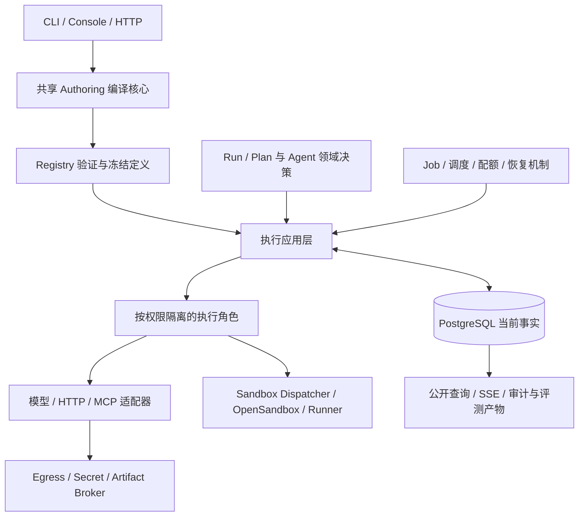

# Agent 平台架构重整 Spec

| 属性 | 内容 |
|---|---|
| 文档性质 | 目标设计；不描述已交付行为 |
| 状态 | 设计交叉评审完成；目标提案，尚未实施 |
| 日期 | 2026-09-06 |
| 基线 | `f6d58a09`；以评审记录中核对的工作树为准 |
| 本次交付 | 全量架构 spec、代码与文档目录设计、交叉评审；不实施代码或 schema 变更 |
| 对应决策 | [ADR-0009](../../adr/0009-durable-kernel-and-agent-domain-boundaries.md)，当前为 Proposed |

## 目标与范围

将现有平台整理为一个可独立理解和验证的持久执行底座、明确的 Agent 领域模块，以及多入口编译、执行适配和部署工具。
保留 PostgreSQL current-state authority、统一资源生命周期、公开 `/v1`、有界 Plan 与独立 Sandbox 信任边界。
目标是减少跨层依赖、重复执行机制和隐含恢复语义，同时使已有编排能力可通过普通作者入口完整使用。

本 spec 覆盖目录与依赖、定义与执行分层、事务和调度、调用与恢复、版本及数据演进、作者和产品入口、框架扩展、
安全与部署、事件与读取、保留与联合恢复，以及相应的行为验收。章节是目标架构的组成部分，不是按投入收益排列的路线图。

本次不引入第二工作流引擎、事件重放 current state、通用任意脚本表达式、Console/BFF 数据库、Provider 业务状态或另一套配额账本。
不恢复 Python SDK、旧 DSL、单进程业务 runtime、宿主代码执行或已移除的 Sandbox fallback。
长期会话、可变跨 Run 记忆、沙箱复用池、强隔离微虚拟机与外部评测平台不在本次实现范围；接口不得假定它们已经存在。

## 阅读与设计文件

- [执行与持久化](execution-and-persistence.md)：身份、事务、调度、取消、版本、Outbox、保留与恢复。
- [作者入口与集成](authoring-and-integration.md)：共享编译、唯一 IR、Agent 组合、Console 与框架边界。
- [安全、部署与证据](security-and-operations.md)：信任域、角色组合、当前授权、镜像闭包与验证。
- [目录与文档重整](repository-and-documentation.md)：目标目录、模块拆分、移动约束与文档生命周期。
- [目录迁移清单](repository-layout.json)：覆盖当前 workspace、工具与相关顶层资产的提案清单。
- [执行合同目标附件](execution-contract-targets.json)：本提案需要共同审查的精确调度与执行参数；不是当前机器合同。
- [交叉评审记录](review.md)：发现、处理、验证以及设计与实施门禁的区分。

机器附件只服务本次设计评审。实施时，其决定必须先进入 owning Rust type、生成合同或 migration；不得让 runtime 读取
`docs/specs`，也不得在实施完成后把附件保留为第二套业务配置或规范。

## 现状与目标的区别

当前仓库已具备纯领域决策、shared Job、精确资源绑定、真实 PostgreSQL 集成测试和受控 Sandbox 路径。
本 spec 不是把这些机制重新实现一遍，而是收紧其组合方式并补齐协议闭环。

需要改变的结构性问题包括：通用 repository 同时承担多个领域与适配器集成；编排应用层直接接触 SQL；
调度共享单行并在选定整批后才判断配额；资源版本与解释器语义版本尚未构成完整执行路由合同；
Outbox 的通用投递路径未闭合；普通 authoring 与运行时表达力不匹配；交付路径和文档存在重复清单及漂移。

这些观察是设计输入，不是性能测量或生产事故结论。配额批次阻塞、容量上限和升级行为必须通过相应行为场景验证。
生产级多故障域、容量、soak、restore 与 GitOps promotion 仍遵循[现有资格状态](../../qualifications/README.md)，不能由本 spec 宣称通过。

## 目标职责

这是一张职责图，不是网络调用或独立微服务清单。领域决策与提交端口可以在同一受信任进程内组合；哪些边界必须跨进程由
权限、伸缩与故障隔离决定。跨领域的原子操作仍使用一个 PostgreSQL transaction，不拆成多个远程写入。

| 职责 | 当前事实归属与边界 |
|---|---|
| Definition / Registry | 定义、不可变版本、部署绑定、依赖解析和验证；不保存运行过程 |
| Run / Plan Runtime | Run 控制意图、节点与 scope、数据依赖、父子关系及逻辑收敛 |
| Agent 领域 | Model、Capability、Context、Skill 的差异化语义；复用现有 aggregate 和 payload |
| Durable 机制 | shared Job、attempt、lease/fence、等待、领取、预算提交与恢复调度；不解释 Provider 协议 |
| Task | 人工交互、到期和 first-winner；等待人时不持续占用物理执行 lease |
| 数据与安全 | Artifact/Blob 生命周期与当前授权、凭证绑定、受控 I/O；Broker 不拥有第二业务状态 |
| 执行适配器 | 编解码、外部 I/O、取消/查询与结果证据；不直接裁决 Run 终态 |
| 产品与工具 | 客户端编排、读取投影、发行、部署与资格证据；不建立第二 current-state authority |

## 依赖与事务规则

领域函数只接收已验证事实、命令和数据库观察时间，返回具体的类型化决定。不得读取环境、系统时钟、凭证、网络或数据库。
Plan 定义和表达式校验拥有独立的纯模块，运行时解释器依赖该模块；定义模块不依赖解释器、Job 执行器或存储。

应用用例通过领域拥有的窄 port 读取事实和提交命令。PostgreSQL adapter 实现这些 port，并将跨领域原子操作组合在同一个
Unit of Work 中。该 Unit of Work 只表示调用者已经拥有的 transaction，不是新的持久化对象、服务或通用 mutation DSL。

`PgRepository` 不继续作为所有角色共享的全能接口。按 Registry、Run、Invocation、Task、Artifact、Security 等实际 owner
拆分命令实现与角色可见端口；公共数据库连接、错误映射、锁顺序辅助与 schema provisioning 保持共享。
不为了拆文件而复制 quota、Receipt、Event 或 lease 实现。

存储层可以依赖纯领域决策；不得依赖 HTTP/MCP/模型 wire codec、Provider client 或 Broker 的物理 I/O 实现。
外部适配器的请求与结果合同移至对应领域的边界模块，存储和适配器分别依赖它。应用层不得依赖 SQLx。
进程 composition root 可以装配 PostgreSQL adapter、RPC client 和领域 handler，但不包含业务状态转换。

所有命令遵守 owning 锁序。外部 I/O 发生在事务之外；开始前提交意图，结果返回后重新验证当前 owner、fence 和操作目的权限。
授权区分新业务执行、正文披露和受限系统完成/核对/清理：撤销前两者，仍允许合法系统身份记录已准入副作用的证据并结算额度、
完成取消和清理；系统完成权限不能发起新业务动作或向被撤销主体披露正文。取消、授权撤销与正常完成之间的互斥不能由缓存、
先读后写或原子性被拆散的多次 RPC 模拟。

## 模型收敛规则

保留逻辑调用身份与物理 attempt 身份的区别。重新领取不自动授权重做外部副作用，业务重试取决于 effect、幂等和恢复证据。
ModelTurn、CapabilityInvocation 与 Context 的 payload 保持各自语义；共享执行协议不要求它们使用同一种逻辑 aggregate。

Resource 共享生命周期继续用于现有资源种类。RAG、Research、Text2SQL 和审批 Agent 默认是 Plan 组合，不能仅因产品名称新增
服务、资源种类、队列或数据库表。业务表数量不作为优化目标；新增对象仍必须证明独立生命周期、并发边界或核心查询。

本提案新增的租户调度状态表满足这一要求：它迁出既有调度集合中的租户 deficit，并新增持久 Job 扫描 continuation，拥有独立的
租户并发和索引查询边界，避免有界候选窗口驱逐公平状态。分区行只保留轮转协调状态，Job 仍是唯一执行候选来源；不建立第二 ready queue。

public Operation 保持现有 Job 的安全投影。读取模型、metrics、Event、Provider observation 和缓存均不得成为执行、权限或额度的裁决者。
恢复 scanner 复用普通领域命令；不允许只有运维或恢复入口才能执行的隐藏状态转换。

## 合同审查与实施边界

公开 `/v1`、JSON Schema、protobuf、数据库以及进程边界的语义变更，先更新各自 owning authority，再生成或更新下游消费者。
路径移动不会自动授权 wire 名称、schema `$id`、binary 名称、容器内路径、公开路由或签名发行格式变化。

本 spec 的完整评审包含以下相互依赖的合同面：

| 合同面 | 需要共同审查的变更 |
|---|---|
| Definition 与编译 | 唯一 Plan 类型、authoring 版本、输入与源映射、表达式限制、冻结依赖 |
| 执行身份与版本 | Run 语义、编译语义和维护操作 ABI 的各自兼容路由、attempt/effect identity、迟到结果 |
| 调度与配额 | 固定虚拟分区、租户公平状态迁出、查询列与索引、配额可接受子集、有界扫描推进和过载错误 |
| 事件与清理 | Event replay floor、Outbox/JetStream 投递及角色合同、Job 化 PKCE cleanup 与耗尽恢复、凭证引用及清理 fence |
| 产品读取与命令 | Task 列表及表单投影、内容读取、SSE continuation、Receipt 与 ETag |
| schema 与生命周期 | 向前迁移、受控 cutover、版本 reader、保留依赖、恢复执行隔离 |
| 部署与权限 | 角色/权限/镜像/配置闭包、复用边界、业务与恢复容量、故障证据 |

设计评审完成不等于这些机器合同已经修改或验证。ADR-0009 在提案阶段保持 Proposed；实施者必须将对应切片的 owning types、
机器合同草案和必要 migration 与本设计共同审查，解决语义差异并接受相应 ADR 后，才开始下游实现或 schema 应用。
这一门禁不要求所有切片一次性发布，但任何可运行提交都必须是单一实现路径、合同一致且完整接线。

保留已发运 migration，不因目录优化改写其内容或 checksum。不假定当前 baseline 从未被用户安装；默认采用保留数据的向前演进。
精确字段、状态、wire 值和限制由 owning type/contract 定义，本文只解释行为和不变量。

## 变更的完整性与验收

实现完成应由行为证据判断，而不是目录看起来整齐、crate 数减少或静态生成通过。详细场景由各子 spec 拥有；整体必须同时满足：

- 相同逻辑调用跨重试保持稳定身份，旧 attempt 不能覆盖当前结果，不确定外部写入不被自动重复。
- 一个饱和租户或不兼容 worker 不妨碍其他可执行工作持续推进；硬配额从不超卖。
- 活跃租户超过单次扫描窗口时公平状态仍保留；同租户被配额拒绝的前排任务不能永久遮挡可准入任务。
- 取消和终态可以关闭新工作；合法的并发完成、人工响应和 callback 仍保持 first-winner。
- 权限撤销阻止新副作用与正文读取，合法系统完成仍记录已发生事实；清理耗尽后有受控、可审计的恢复路径。
- 消息丢失、重复、乱序和 publisher 重启不会改变当前状态；积压能完成投递或进入明确失败处置。
- 事件保留推进后不会把历史缺口伪装成完整接续；有效签名和 TTL 不能绕过 replay floor。
- 旧 Run 只能交给语义兼容的 worker，迁移及恢复不会把历史副作用当成从未发生。
- 相同 authoring 输入产生相同 Plan，普通作者可以完成检索、模型、工具、人工任务、子 Agent 和恢复组合。
- 各执行角色无法获得超出其边界的凭证或存储权限，拒绝路径、日志与内容读取保持分类及授权约束。
- 路径移动同时更新编译、镜像、发行、CI、测试 fixture 和文档引用；旧路径不以 wrapper、symlink 或兼容 crate 保留。

资格 harness 在 CI 缺少必需环境、角色或服务时必须失败，不能静默 return 后显示通过。纯单元测试与需要真实依赖的测试应明确分组。
对照合同的独立检查仍然保留；不以同一生成器的输出自比替代行为验证。性能参数是合同预算，只有实测对应 exact revision 后才能称通过。

## 文档退出条件

本 spec 不进入 `docs/current`。目标实现、机器合同、当前文档和可追溯证据一致之后，将持久架构取舍保存在 accepted ADR，
把可观察行为写入 current，把贡献者流程写入 engineering，并删除本提案目录及其机器附件；历史由 Git 保存。
若只完成部分切片，保留提案并明确标记未完成范围，不把完整目标改写成当前架构。
