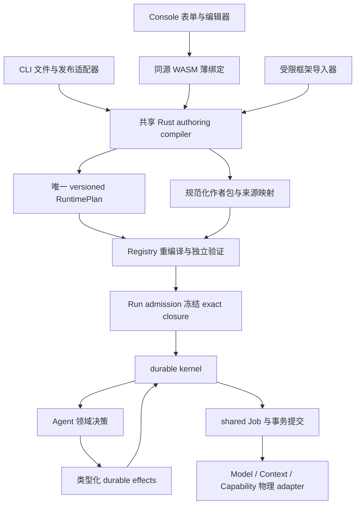

# Authoring、Agent 语义与集成边界重构提案

> 状态：Proposal，设计交叉评审完成；实施前仍须与 owning 机器合同共同评审。本文描述目标，不声明目标已经实现。
> 范围：共享编译、Agent 与 durable kernel 的接口、作者入口、Context/Capability/Skill、框架集成、Console 与质量评测。
> 本文不授权变更已发布 schema，不新增业务 authority，也不改变现有生产资格状态。

## 1. 目标与当前依据

目标是使 CLI、Console、公开 HTTP 自动化和框架导入共享同一套 Agent 语义，并使全部受支持的运行时能力可以通过作者入口使用。
平台保持一个 durable kernel；模型、工具和数据观察保留不同的领域合同；物理 adapter 不推进业务状态。

本提案建立在以下当前 authority 上，具体字段、状态与限额仍以链接中的 owning type、机器合同和迁移为准：

- [Agent compiler](../../../crates/insight-cli/src/agent_compiler.rs) 与 [compiler corpus](../../../contracts/product-experience/agent-compiler/v1/corpus.json)：当前产品编译器只提供简单执行模板，Rust 与 TypeScript 分别实现语义。
- [RuntimePlan、RuntimeNode](../../../crates/platform-orchestrator/src/lib.rs) 与 [typed expression](../../../crates/platform-orchestrator/src/expression.rs)：已有控制流、领域调用、人工等待和类型化端口。
- [Agent、Skill owning types](../../../crates/platform-contracts/src/resource.rs)、[Context](../../../crates/platform-contracts/src/context.rs)、[Capability](../../../crates/platform-contracts/src/capability.rs)、[Model](../../../crates/platform-contracts/src/model.rs)。
- [Task 领域决策](../../../crates/platform-tasks/src/lib.rs) 与 [baseline migration](../../../crates/platform-postgres/migrations/0001_platform_baseline.sql)：Task、RunValue、Run、Job 和 Artifact 已有持久化 owner。
- [public OpenAPI](../../../contracts/platform-v1/openapi.yaml)、[当前 CLI](../../current/cli.md)、[当前 Console](../../current/console.md)、[当前 MCP](../../current/mcp.md)。
- [ADR-0004](../../adr/0004-product-surface-boundaries.md)：产品入口不拥有业务 authority，Console 为静态客户端，业务 mutation 通过公开合同。

当前 Console 的 Task 页面按 ID 查询并接受原始响应 JSON，当前公开事件接口返回有限 SSE 页面。因此本文的待办、schema 表单和持续跟随是目标行为，不能从当前文档中的产品名推导其已经交付。

下文模块名称表示逻辑职责；物理目录与 Cargo package 归属服从总体重构文档的唯一目录映射，不在本文另建一份目录规范。

## 2. 架构决策

决定共享 Rust 编译核心及 Rust-to-WASM 绑定，不继续维护另一份 TypeScript 语义编译器。两种目标使用同一 Rust owning type、解析器、类型检查、规范化和 IR 生成代码。
WASM 只是静态 bundle 中的编译能力，不是新服务、不持有身份，也不执行 Agent。

唯一 IR 由 `plan-ir` 逻辑模块拥有。`agent-authoring` 依赖它，kernel 与 Registry 消费它；IR 不依赖 CLI、React、数据库、Worker、网络 client 或物理 provider。
从现有 `platform-orchestrator` 抽出 IR 时保留 wire 语义；纯目录或模块移动不构成升级 `plan_version` 的理由。

Agent 领域决策由 `agent-execution` 逻辑模块拥有，调用 shared kernel 的类型化接口。ModelTurn、CapabilityInvocation、ContextQuery/Observation 等已有领域生命周期不被合并为一个开放 JSON Invocation。
kernel 提供 durable 机制，不嵌入 provider SDK、prompt 模板、检索算法或框架运行时。

## 3. 共享纯编译核心

### 3.1 模块职责与依赖

`agent-authoring` 承接当前 CLI compiler 的纯逻辑，文件系统、alias 查询、credential、上传、Receipt、ETag、Operation 轮询与 journal 留在入口 adapter。
该核心同时构建为本地 Rust library 与浏览器 WASM。薄 WASM wrapper 只转换有界字节输入、结果和错误，不重新实现业务默认值或校验规则。

编译核心不得导入 filesystem、network、process、clock、random、数据库或 credential 能力。为构建 WASM 必须从共享合同依赖中隔离平台专用功能，不能通过在浏览器中伪造 OS adapter 使其编译通过。
编译不产生新的 ResourceId、时间戳或 Receipt；这些由生命周期 adapter 或服务端 owner 生成。

CLI 输入 adapter 继续拒绝项目外路径、符号链接逃逸和不安全 YAML。浏览器将用户显式选取的本地文件构造成有界虚拟文件包，使用规范相对路径；浏览器目录对象不进入编译核心。
两个入口使用同一 YAML/JSON 解析器。Console 表单生成的规范化作者输入也必须通过同一核心，不能另走直接生成 IR 的路径。

WASM 在专用 Web Worker 内运行。编译的输入大小、文件数、节点数、表达式复杂度、诊断数量和输出大小受 owning limit profile 限制；UI 可以取消 Worker，但取消不生成成功编译结果。
WASM 初始化失败、接口版本不匹配或资源上限触发时返回明确的编译失败，不回退到旧 TypeScript compiler、远程编译服务或未校验预览。

### 3.2 编译输入、产物与可重复性

输入概念为：作者源文件包、schema 文件包、所选 authoring dialect、编译限额与策略快照、已解析的 exact dependency binding。
机器合同必须分别定义这些结构的版本和边界；本文不复制完整字段集。
作者包显式固定 compiler semantic identity 和 compile-policy inputs digest。前者标识解析、默认值展开、lowering 与规范化的解释语义，后者绑定本次编译使用的 exact 策略引用及规范化策略输入；二者不由 compiler build digest 或当前租户默认值替代。

编译产物包含可用于现有 Artifact materialization 和 Resource lifecycle 的作者包、RuntimePlan、依赖需求、Resource intent、诊断和来源映射。
作者包保存重编译所需的规范化输入及引用，不能保存 credential、Secret value、任意 endpoint 或用户运行输入。
依赖解析结果包含 exact 身份与合同摘要；不得将凭证或可变 alias 作为可执行 IR 的权威引用。

相同规范化源、schema、编译语义版本和 exact binding/策略输入必须生成相同 canonical IR bytes 和语义 digest；本地目标与 WASM 必须逐字节一致。
诊断展示位置、文件绝对路径、UI 布局、编译耗时与 compiler binary digest 不进入 IR 语义 digest。
compiler build provenance 单独随发行物和作者包记录，不能用 build digest 代替 authoring/IR 语义版本。

source map 将作者节点、端口和表达式位置映射到 IR 身份。source map 是不可变构建产物，用于诊断和 Run 展示，不是运行状态 authority。
节点 ID 必须由显式稳定名称和规范 scope 路径生成，不能使用遍历时随机 ID、浏览器组件序号或文件系统枚举顺序。
对名称重用、scope 冲突和不唯一映射在发布前报错；不能静默改名来“修复”语义。

### 3.3 编译流程与错误

编译分为输入解析、结构校验、依赖需求提取、exact binding 归一化、schema/端口检查、表达式检查、IR 生成、IR 独立验证和产物规范化。
本地结构错误必须在 alias 解析、Artifact 上传和 journal mutation 前返回。依赖缺失则返回可供 adapter 查询的类型化需求，不由 compiler 自行联网补齐。

错误必须携带稳定机器 code、源位置与安全解释，并区分作者错误、依赖不可用、版本不支持和编译器内部错误。
错误闭集由 owning Rust type 生成到边界合同；CLI 与 Console 只进行本地化和展示，不创造与服务端冲突的重试语义。
诊断不得回显 Secret、完整文件正文、敏感 prompt 或跨租户候选信息。

### 3.4 版本与替换

新增完整 authoring 表达力需要一个显式版本的作者合同；当前简单模板可以在新合同内作为语法糖，二者均由同一核心生成 IR。
必须删除旧 TypeScript 语义编译器及其运行时 fallback。原 corpus 保留为语义回归证据，再扩展新的机器 corpus。

已经发布的 Plan、Artifact 和正在运行的 exact closure 不因编译器替换而被重写。需要升级 IR 语义时，按照总体部署兼容与在途 Run 处理合同执行，不能在反序列化时隐式升级旧 Plan。
本提案不批准永久双版本执行器，也不批准在客户端覆盖旧 immutable revision。

compiler semantic identity 的支持窗口独立于执行中的 Program semantic identity，由编译兼容 owning contract 与签名发行闭包声明。
退出旧 compiler/作者包 reader 前必须核对 pending Registry validation Job、仍需完成的 Draft validation/publication、Receipt replay 以及已承诺的编辑恢复窗口；不能仅因没有运行中的 Run 使用该 compiler 就移除它。
不兼容的新 build 不接管旧编译任务。超出支持窗口的发布必须明确拒绝；旧工作只能按原合同终结或经既有受授权命令明确关闭，不能默默套用新规则。

## 4. 唯一 IR、Registry 验证与 exact binding

### 4.1 解析与冻结职责

作者使用可理解的项目/租户 alias；入口 adapter 通过公开 API 取得有权限的 exact candidate，向纯编译器提供解析结果。
authoring profile 表示租户策略、可用 dialect/IR 语义与 compiler 限额，不再承担一个无限增长的全量依赖目录。
dependency discovery 和批量 exact resolution 是有界查询，使用同一 Resource/Version/Deployment authority，不建立 alias 数据库。

解析结果不授予调用权限。Registry validation、Deployment validation 和 Run admission 分别在各自边界重新检查该 exact 对象是否可用、是否属于正确租户、合同是否匹配、策略是否允许。
发布过程中 alias 的 active head 改变，不得偷偷替换编译时所选依赖；exact target 仍允许时继续引用原 target，不允许时返回失效诊断，要求作者重新编译。
Run admission 选择并冻结获准的 exact closure；运行中的 ModelLoop 与子 Agent 不通过 alias 再解析 mutable head。
已经发布的 immutable Plan 在 admission 和恢复时直接按冻结 IR/Program semantic identity 验证并执行，不重新编译作者源，不因当前 compiler 或 authoring profile 改变而生成另一份 Plan。

### 4.2 Registry 是最终发布校验者

Agent/Plan 的 Registry Validation Job 在原 Draft validation 事务中冻结 exact Draft generation、作者包/候选 IR 引用、compiler semantic identity 和 compile-policy inputs digest；Job 领取条件使用可索引的编译兼容要求。其他资源的 Registry validation 按其 owning validator ABI 执行，不借用 Agent compiler identity。
Registry Validation Worker 只能领取签名 manifest 明确支持该 compiler semantic identity 的 Job，start/commit 继续校验相同身份、输入 digest 与 Job fence。实际 compiler build 作为执行证据记录，不由 worker 自报“最新版”替换冻结语义。
Worker 通过受控 Artifact 读取取得作者包与候选 IR，使用匹配冻结 semantic identity 的同一 native Rust compiler 重新编译，再用 `plan-ir` 独立验证图、端口、scope、限额、依赖需求和输出合同。
候选 canonical IR、Resource intent 中的语义引用以及重编译结果必须一致。客户端的“validated”标记、WASM 校验或可伪造 compiler build identity 均不能跳过这一步。

重编译输入必须可从 exact 作者包和 authority 引用重建；Registry 不接受依赖开发者本机文件、未上传 schema 或仅存在于 React state 的输入。
Registry 对可变可用性和权限作服务端验证，同时使用作者包中固定的编译策略引用重建语义；不以当前默认值替换已经提交的编译输入。

原始 HTTP 和 advanced `apply` 继续只管理公开 lifecycle。在新的 authoring 发布合同下，手工构造的 Agent 也必须提交可独立验证的作者包和对应 IR；不存在一个跳过来源一致性检查的“高级 Plan”通道。
框架导入器先生成统一作者表示，再进入同一个编译/验证流程，不为某框架引入专用 admission bypass。

mandatory source/IR 一致性是新的发布合同要求，不是对所有既有作者包的无损兼容声明。已经发布的 immutable Plan 继续按原读取和执行兼容合同使用，不能被追溯要求补写或伪造作者源。
已有 Draft 或手写 Plan 缺少可重编译源包时，在新 validation 合同下返回明确的 `recompile_required` Problem；客户端要求作者提供真实源并创建新的 Draft generation，不自动从 IR 编造“原始 source”。
切换前必须审计尚未完成的旧 validation/publication 及其 Receipt：按已承诺的旧语义完成或明确关闭后重新编译，不能把旧 Operation 的重放结果改成新 validation，也不能静默修改原 request digest。

### 4.3 依赖方向

`plan-ir` 只拥有运行计划的结构、类型关系与纯验证，不调用 Registry 或数据库。
Registry 拥有“某份计划及其依赖可以发布”的判定；runtime admission 拥有“该租户现在能创建这次 Run”的判定。
compiler 只拥有“给定 exact 输入能否生成合法计划”的判定。三种判定不能合并成一次客户端 validate。

## 5. 完整 authoring 能力与入口一致性

目标作者合同是在同一 manifest 中表达命名节点、类型化数据连接、scope 与受限表达式；它是 RuntimePlan 的作者表示，不是另一套有不同执行语义的 DSL。
简单模板只是 compiler 展开规则。Console 的表单/流程编辑器使用同一作者表示，导入未知受支持节点时必须无损保留，不能降级为简单模板后丢弃流程。

下表按用户操作分组，用于覆盖性验收；节点闭集和字段仍只由 `RuntimeNode` 及其机器合同拥有。

| 作者操作 | 到现有 IR 的映射 | CLI 与 Console 的目标行为 | 公开边界影响 |
|---|---|---|---|
| 定义入口和结果 | Start、Return 与 exact input/output port | 简单模板及完整流程都能验证、发布、运行；表单自动处理入口连接 | 复用 Resource lifecycle 与 Run 创建 |
| 转换结构化数据 | Compute 和 bounded TypedExpressionProgram | 提供类型感知表达式编辑、schema 路径诊断；不执行 JavaScript、Python 或 shell | 作者合同扩展；无需新执行 API |
| 条件路由 | Branch 的有序条件与明确默认分支 | 导入/导出保留顺序；显示无效条件与不合法端口 | 作者合同与 compiler corpus 扩展 |
| 并行及聚合 | Fork/Join 的 join policy、quorum 与剩余工作处理 | UI 表达各分支及汇合策略，校验 scope；不只画无语义连线 | 复用已有 Run 与节点事实 |
| 有界批处理与循环 | Map/Loop 的输入、carried ports、次数与失败策略 | CLI/UI 都要求可验证上界，编辑器区分当前轮与下一轮数据 | 复用 kernel 控制流，扩展 authoring 语义 |
| 错误处理 | ErrorBoundary 与 Raise | 选择 owning failure code、映射 handler 与 typed failure port | 复用 failure 合同，不引入字符串异常协议 |
| 模型推理和工具循环 | ModelLoop 的 Model、Skill、Capability slots 及预算 | 配置有权限的模型/工具/Skill、轮次和预算；检查 profile 能力 | 需要依赖查询/解析与扩展 profile，不增加聊天专属执行 runtime |
| 调用操作 | CapabilityCall 及候选选择、重试合同 | 以 Capability 名称配置，不要求作者填写 provider endpoint；展示 effect 和审批要求 | 复用 Capability/Deployment，公开安全摘要来自 owner |
| 读取数据观察 | ContextQuery 的查询、结果与数量限制 | 选择 Context、一致性策略与结果端口；显示引用约束 | 复用 Context/Deployment，提供可发现的 authoring binding |
| 调用子 Agent | ChildAgentCall 的输入输出、预算与取消策略 | 引用 exact Agent interface，显示父子预算关系，校验 descendant 上界 | 复用 Child Run authority，不新增 subagent session API |
| 人工响应 | HumanTask 及审批型 Capability 的既有任务语义 | 作者定义任务输入/响应 schema 与合资格主体规则；操作端显示表单 | 增加 Task list/form 读取，mutation 复用现有 Task 动作 |
| 时间与信号等待 | TimerWait/SignalWait | 编辑器显示超时路径和 payload schema；CLI/UI 可发送受权信号 | 复用公开 Run signal API，补齐产品入口 |

依赖需求、输出 schema、data classification、预算和 feature requirement 从完整计划导出，不能继续假定所有 Agent 只有一个 Model。
各节点的数字上限来自同一 limit/profile owner；UI 的滑块或默认值不能成为第二个限额规范。
父节点与子节点、循环与外部调用的预算组合必须可验证，超出策略上界在发布或 admission 时按合同拒绝。

`insight agent validate/publish/run/logs/result` 覆盖完整计划。advanced 命令保留低层诊断与公共 HTTP 自动化，不再是正常工具/RAG/HITL/子 Agent 旅程的唯一入口。
Console 支持完整作者表示的导入、schema 编辑、节点与连接编辑、校验、发布与运行；图形布局是本地编辑投影，既不写入执行 IR，也不改变 source map 的稳定身份。
CLI/UI 必须支持从服务端已发布作者包恢复编辑上下文；原始 Artifact 受权限控制，无权读取时不得以不完整模型覆盖现有 Agent。

## 6. Agent 领域与 kernel 的类型化接口

### 6.1 决策输入与结果

领域 handler 接收已校验的节点合同、冻结依赖、当前领域事实、父 scope 预算和当前观察；返回纯类型化决策。
handler 不持有 PgPool、网络 client、对象存储 client、provider credential 或用户进程执行能力。
需要物化输入或 Skill 内容时，由受权 materialization adapter 在事务外完成，携带 scope/fence 和内容 digest；提交前必须再次验证 owner 及 lease。

决策结果中的 durable effects 使用 Rust 闭集和专属参数类型，覆盖推进节点、创建领域工作、挂起等待、接受子结果、失败或终结等机制。
该接口是内部业务接口，不直接成为允许外部客户端发命令的 public RPC。
不得设计调用者自定义 `kind + arbitrary JSON` 的 effect envelope，也不得把 provider URL、SQL 字符串或 shell 指令塞入通用 effect 以绕过 Capability 合同。

kernel 检查 effect 的 owner、generation/fence、父子 scope、预算守恒、顺序与状态前提，再由 owning command/repository 在规定的锁顺序中提交。
领域 handler 不能分开提交 Job 与父节点等待状态，不能自行写 Event/Outbox，也不能使用内存回调作为继续运行的唯一依据。
回收、取消、超时和重试都重新读取 authority 并重新决策；不重放一个已经失去 fence 的内存 effect batch。

### 6.2 共享机制与保留语义

共享 Job claim/lease/heartbeat、deadline、fenced commit、Receipt、Outbox、value/artifact link、预算事务原语及 wait/wake 机制。
保留 ModelTurn 的多轮消息与用量结算、CapabilityInvocation 的 effect/审批/幂等、ContextQuery/Observation 的数据一致性与引用语义，以及 Task 的 first-winner 决策。

ModelLoop 每轮生成和工具调用结果是领域 continuation；kernel 不理解 provider message 格式。动态工具选择仅可选择冻结且获准的 Capability slots，不得生成新 endpoint 或扩大权限。
Context 返回数据观察，不向 kernel 注入控制指令。Task 的可执行动作由 Task kind、owner 和当前权限共同决定，UI 的按钮状态只是投影。
ChildAgent 创建独立子 Run 及明确父子预算/取消关系；不能通过把其伪装成普通外部工具来丢失 descendant 约束。

Model、Context、MCP 的物理 adapter 仍在受控 Worker/Host 中，按已发布合同安装。此接口不允许在 orchestration 进程中动态加载用户 plugin 或运行框架代码。

## 7. Context、Capability、Skill 与组合业务

Context 的输出是有界观察：它解释数据来自哪里、在何种一致性视图下读取、何时观察、依据什么权限与引用合同。
Capability 的输出是一次有权限、effect、重试与副作用约定的调用结果；只读操作也属于行为合同。
Skill 是不可变的指令与资源包，可声明依赖需求，但不拥有另一套执行调度器、任务表或 session 生命周期。

Context 的 backend kind 不等于安装可用能力。authoring discovery 必须分别表达合同兼容、可用 exact Deployment 和调用权限，不能把枚举中存在的 ManagedIndex/SQL 等自动展示成可执行产品。
所有数据源返回的 prompt-like 内容均为数据观察；Skill 与作者指令按现有 prompt 装配的来源和信任规则处理，不通过命名提升为平台安全指令。

RAG、Text2SQL、Research、审批和评测是 Agent/Plan 组合，默认复用当前 authority。
例如 Text2SQL 由 catalog Context、模型生成 typed SQL plan、纯 admission 校验和 read-only database Capability 组成；当前 [Text2SQL 校验](../../../crates/platform-context/src/text2sql.rs) 已说明不创建专用 persistence authority，应保留该约束。

Parser、chunker、embedding、retrieval 和 reranker 的物理实现属于 Context provider/数据处理组合，不进入 kernel，也不在 prose 中宣称仅凭类型存在就已完成实现。
Dataset generation 的独立生命周期沿用既有 owner；不把它降级为临时 prompt cache。
跨会话记忆若被提出，必须另外证明独立生命周期、并发控制与删除/保留语义；本文不通过复用名称 `Context` 自动授权一个 memory 数据库。

## 8. 框架集成的 durability 合同

### 8.1 编译集成

编译集成接受显式导出的、数据化且有界的 framework graph manifest，转换为共享作者表示，再使用同一 Rust compiler。
每个受支持 framework adapter 必须发布其语义映射、版本、能力限制和 conformance corpus。
不能在 Gateway、Registry 或 orchestration Worker 中 import/执行任意 Python/JavaScript 来“发现”图。

只有能保持类型、节点身份、scope、等待/恢复、错误、预算、取消和副作用边界的子集可以映射成功。
动态拓扑、任意共享可变状态、自定义 reducer、宿主代码闭包或框架特有恢复语义不能无损映射时，编译明确拒绝；不能静默退化成不同的运行语义。
被编译的节点由平台拥有 durable state；框架 checkpoint 不是这些节点的另一个当前状态 owner。

### 8.2 黑盒集成

黑盒集成把外部框架作为一个 Capability 部署在 Remote 或 Sandbox 后端。平台拥有 Invocation/Job 及其输入输出、deadline、审批、quota、重试和取消请求的 durable 边界。
框架内部节点、checkpoint、外部副作用以及内部续跑由框架应用及其 backend 合同负责。

Capability 合同必须明确外部执行是可重入、可查询同一逻辑操作，还是出现不确定结果时不能安全重试；这些规则沿用 effect/idempotency owner，不创建 framework-specific receipt authority。
有远端 durable operation 的 adapter 将其标识持久化到已有 typed continuation，并验证与当前 Invocation 的关系；进程内缓存和外部状态不能覆盖 Platform terminal outcome。
cancel 请求已接受不等于外部副作用被撤销；若后端不能证明取消结果，按已审查的 Invocation 不确定结果语义处理。

产品视图明确标出恢复粒度：编译集成为平台节点级，黑盒集成为 Capability 调用边界。两者不能使用一个没有语义说明的“durable integration”标记。
当前 [LangGraph reference](../../../examples/productization/langgraph-reference/graph.mjs) 只作为黑盒边界示例；不得根据该示例声明其内部节点获得平台 durability。

### 8.3 集成公共约束

两种模式均不得读取 Platform 数据库、内部 RPC、Worker credential 或 Sandbox runtime socket。模型与外部调用权限来自原有 exact binding 与 Egress/Secret 合同。
不新增框架专属 runtime、queue 或业务数据库。外部框架可以拥有其独立内部生命周期，但必须位于黑盒边界之外，并清楚标注哪个业务事实由谁拥有。

## 9. Console、待办与安全可用观测

### 9.1 真实待办与 schema 表单

待办列表由 PostgreSQL Task authority 的有界查询提供，不从 Event 历史或浏览器缓存重建。
默认查询当前主体可响应的待办，另以明确权限提供可查看任务；tenant、principal 与授权过滤发生在数据库读取边界。
列表采用稳定 keyset 分页，cursor 绑定主体、租户、过滤条件和授权上下文；权限变化、截止时间变化和分页中的并发响应不能导致跨租户泄漏。
响应资格包含不能直接由索引表达的纯领域规则时，SQL 仅执行租户、可见性和可索引条件的粗筛，读取层在有界扫描预算内逐项调用 owning authorization/eligibility 决策。不能把完整资格规则复制成数据库状态机。
分页 cursor 按最后已扫描候选的位置推进，不按最后返回的可响应任务推进；过滤后可以返回空 items 与有效 next cursor。不得先 LIMIT 再过滤并误报“没有下一页”，也不得为填满页面无界扫描。并发变化按 current authority 重验，响应时仍由 Task command 裁决 first-winner。
验收需覆盖连续多页候选均无资格后仍能发现后续合资格任务、空页继续、规则变更、撤权和扫描预算耗尽，证明分页不会丢失仍可访问的后续任务或泄漏被拒绝候选的内容。

Task form 投影返回 current generation/version 的安全提示、允许动作、响应 schema 和构造现有提交合同所需的不可伪造语义引用。
schema 从 Task 及其冻结 owner 合同解析，不能仅让浏览器凭 digest 猜测结构。表单元数据是有界、纯展示信息；拒绝远端 `$ref`、可执行脚本、任意 HTML 和不受控链接。
对所有平台支持的交互 schema，renderer 必须能够构造合法的现有 `submit-input` 请求；无对应表单控件的合法结构使用类型化树编辑器，不要求普通用户填写 authority digest。

Approve/Reject/Submit/Cancel 只在该 Task kind 和当前主体允许时展示；服务端每次 mutation 仍重验权限、schema、generation、deadline 和 first-winner fence。
竞争响应或过期导致冲突时，UI 读取当前 Task 并解释实际结果，不能自动生成新 Receipt 重发同一用户意图。
原始 JSON、ETag 与 Receipt 保留在 advanced diagnostics；响应正文不得进入浏览器持久化恢复记录。

### 9.2 安全的持续 SSE 跟随

保留现有有限 durable SSE 页面合同。Console 与 CLI 的“持续”体验由客户端在页面关闭后用最后接受的 opaque cursor 重连实现，不把现有 endpoint 改成无界连接。
读取采用增量 UTF-8/SSE 解码、字节/event 限额、有限内存窗口和 AbortController；空页采用有界退避，前台恢复时可以重新读取当前 Run。
同一 Run 的跟随器只能有一个有效 generation；切换 Run、主体或 Gateway session 时停止旧请求并清空旧内容投影。

客户端对重复完整 event 投影幂等处理，不解析 cursor 内部序号。cursor 只在一个完整 event 被接受后推进；断在 UTF-8、SSE frame 或 JSON 中间时重连不能跳过事件。
每次服务端读取同时检查 cursor 身份/签名/TTL 和[执行与持久化提案](execution-and-persistence.md)定义的 Run replay floor；cursor 即使尚未超过 TTL，只要要求的历史已越过保留下界，也返回合同定义的历史不可用错误，不能静默跳过已删除事件。
cursor 失效后按公开恢复合同重新建立 bounded history，初始页说明实际可读取起点与缺口；UI 明确显示历史缺口，不把缺失页补成“已完成步骤”。客户端不猜测 floor 或解码 cursor，也不自动转向归档继续 live replay。
Run 当前状态与结果始终重新读取 Run authority；事件触发刷新，但不在 React 中重新执行服务端状态机。看到 terminal event 后仍以终态 Run/result 读取裁决展示。

权限被撤销或 token 失效后停止重连并清除受保护内容；cursor 只可保存在带身份隔离的非正文恢复记录中，token、prompt、tool body 与 Task response 不进入 storage、URL 或日志。

durable progress 与模型 token delta 保持不同合同。[ModelLiveTextDelta](../../../crates/platform-models/src/stream.rs) 是有 fence 的 lossy internal projection，当前并非 public SSE。
本提案不把它直接接到公开事件接口；如需实时生成文本，必须单独评审有权限、可丢失、可替换、按 attempt/fence 隔离的公开投影，终态仍由 durable ModelTurn/Run result 裁决。

### 9.3 授权内容检查

普通事件、日志和列表保持安全摘要。用户显式打开 Run 中某个 prompt/input/output/context 内容时，通过公开的 RunValue 内容读取边界执行当前授权，不在常规事件中复制正文。
metadata list 只返回用户可知的节点/值来源和内容可用性；具体内容读取同时检查 tenant、Run 可见性、value ownership、classification、内容读取权限和当前 retention/Artifact state。
能够读取 Run 进度不自动意味着能够读取所有 input、Skill、tool output 或 confidential Context 内容。

所有正文出口统一使用同一个受限内容授权/读取 port，包括新的 RunValue content、现有 `GET /v1/runs/{run_id}/result` 的 Inline 与 Artifact-backed 分支、现有 Artifact content，以及 CLI `agent result`、默认等待后输出结果和 Console result 展示。
`runtime.read` 只足以读取获准的进度投影，不能让旧 result 路由绕过新增内容权限。对于调用者有权定位但没有正文权限的结果，直接返回 HTTP 403 的 closed Problem；成功时保持原 typed result DTO，不将 Inline 悄悄改成脱敏对象、空结果或伪 Artifact reference。
Artifact result 引用的返回也经过相同内容授权判断，后续 Artifact 下载再次检查当前内容策略和授权；不能因为先取得了引用就绕过撤权。不同路由只能适配表示形式，不能各自实现一套正文授权逻辑。

inline RunValue 由其 owner 读取并验证 schema/content digest；Artifact-backed value 复用现有 Artifact broker 和下载策略，不新增 blob 副本、浏览器 signed URL cache 或 Console 文件服务。
读取结果使用 private no-store、受控 Content-Type 与 byte limit；不执行返回的 HTML/Markdown 脚本，非安全预览类型以受控下载交付。
读取审计只记录主体、owner、策略结论、时间和安全引用；正文与 Secret 不进入审计事件。
数据被删、隔离、损坏或撤权后按当前 authority 失败，UI 清除缓存并显示当前原因，不能使用此前有权限获得的 URL 绕过新状态。

## 10. 公共 API 与合同改动清单

以下为待机器合同实现的候选操作设计，不是已存在的端点声明。精确 DTO、错误 code、permission 与 limit 数值必须由 owning Rust type 和 OpenAPI/schema 定义，经 cross-review 后才能实现消费者。

| 边界 | 目标变更 | Authority 与约束 |
|---|---|---|
| `GET /v1/agent-authoring-profile` | 版本化扩展为 compiler dialect/IR compatibility、策略与限额的有界 profile；完整依赖目录移出该响应 | 保持 tenant Policy/Resource authority；不能用客户端默认值替代缺失策略 |
| `GET /v1/agent-authoring-bindings` | 增加按依赖类别、alias 与环境筛选的有界可发现 binding 页面 | 当前主体有权限的 Resource/Version/Deployment；cursor 绑定过滤与身份，不提供全局 registry dump |
| `POST /v1/agent-authoring-bindings:resolve` | 对 manifest 提取的有界需求批量解析 exact bindings，返回类型化成功/拒绝诊断 | OpenAPI/生成操作分类明确为 query；无命令 Receipt、Job 或持久化 alias 表；仍执行认证、授权与 bounds |
| Resource validate/publish 与 Deployment lifecycle | Agent 发布新合同要求作者包重编译一致性；Agent/Plan validation Job 固定 compiler semantic identity、编译策略输入 digest、完整 dependency slots 与 IR | Registry validation Job 与现有 Resource CAS/Receipt；非 Agent 资源使用其 validator ABI；Agent 缺源返回 recompile_required，旧 immutable Plan 不在 admission 重编译 |
| Run create/signal/control | 将完整计划与信号能力接入现有产品命令/UI，不新造聊天/子 Agent API | 现有 Run admission、typed signal、权限、Receipt 与 CAS |
| `GET /v1/tasks` | 增加 current subject 的可响应/可查看任务列表及有界过滤 | 从 Task authority 查询；依据 query plan 增加必要索引时使用真实 forward migration |
| `GET /v1/tasks/{task_id}/form` | 增加绑定当前 Task generation/version 的安全 schema/动作投影 | Task/owner schema authority；读取不创建独立 form aggregate，禁止外部 schema 解引用 |
| 现有 Task mutation | 保持既有 typed submission 与 first-winner；产品入口自动物化 schema/digest envelope | Task command 重验当前权限与 fence；展示动作不是 mutation authority |
| `GET /v1/runs/{run_id}/events` | 保持有限 SSE wire 语义，补充断流/重连与客户端验收 | durable Event owner；不混入 lossy model delta、不将 cursor 当事件 ID 解释 |
| `GET /v1/runs/{run_id}/values` | 增加有界、授权的 value 来源 metadata 查询，可按节点过滤 | 当前 RunValue 与既有索引/owner；不从日志重建 value catalog |
| `GET /v1/runs/{run_id}/values/{value_id}/content` | 增加显式授权、bounded inline 或 Artifact-backed 内容读取 | 复用 RunValue/Artifact broker；无额外 blob state 或 bearer URL 持久化 |
| 现有 `GET /v1/runs/{run_id}/result` 与 Artifact content | 所有 Inline/Artifact 正文和内容引用分支进入同一受限内容读取 port | 成功保持原 DTO；已获准定位但缺正文权限时明确 403；CLI/Console 不能走旧入口绕过 |

authoring bindings 的权限按目标类别与读取动作判定，不能继续假定一个笼统 `policy.read` 即能看见所有 Capability、Context 或 ChildAgent。
表单、安全 metadata 与内容读取权限必须分别检查；具体 permission 是否复用或新增由 security owning contract 决定，不在客户端硬编码“管理员总能读取正文”。

resolver 的只读性质由服务端 owning operation contract 声明，并生成到 OpenAPI、Gateway dispatch/中间件分类和客户端操作模型；不能仅按 HTTP 方法把所有 POST 当 command，也不能接受客户端 header/body flag 自声明为 query 来绕过 Receipt。
该操作继续受 authentication、逐项 authorization、tenant scope、request/response bytes、需求项数、deadline、rate/capacity 与审计约束，只豁免业务 command Receipt/CAS。未登记的操作不得借 query 分类绕过通用边界。

GET form/value 查询和 resolver 都不提交业务 effect。若读取审计需要落盘，使用既有审计机制，不把 read request 包装为第二类业务任务。
task list、value list 需要 query plan、基数与授权过滤证据；新索引是独立物理 schema 变更，不能重写 baseline migration。

## 11. 质量评测复用执行底座

质量评测定义为普通的已发布 Agent/Plan：输入一个有版本的 evaluation manifest Artifact，生成有界子 Run，调用被评 Agent，再经确定性或模型 evaluator 产出结构化评分 Artifact。
manifest 固定 dataset/sample 身份、被评 Agent/Model/Context/Policy exact 版本、evaluator 版本、重复采样规则和指标 schema；字段由专属 Artifact 合同拥有。
评测的父 Run、子 Run、Task、Job、取消、预算和恢复全部复用同一 kernel，不新增 evaluation scheduler、runtime、queue 或执行状态表。

每个计划中的样本/重复试验具有稳定身份。同一次试验的重试或恢复继续使用同一已分配子 Run/Receipt 关系；作者明确要求的重复试验创建不同身份，不能把失败重试当独立样本提高成绩。
父子 lineage 和指标输入引用使用现有 Run/Artifact 能力；若需要扩展 linkage 类型，应先扩展 owning contract，而非把关联事实只存在于浏览器或报告字符串。

被评结果、evaluator 判断、失败/缺失结果与聚合报告均保留 exact 证据引用。聚合必须记录有效样本和缺失/失败，不能静默排除失败样本或用 fixture 常量充当模型评分。
模型 evaluator 的非确定性与 provider 实际用量可观察，重复实验不承诺相同模型输出；相同 manifest/IR 的确定性不等于真实模型的确定性。

评测数据与 ground truth 按正常 classification、Egress、权限和 retention 合同处理；跨供应商评测不能扩大数据发送权限。
质量分数、协议 conformance、故障恢复测试与 production qualification 是不同证据类型。一个维度通过不自动替另一个维度通过。

## 12. 验收矩阵与证据归属

每条目标在新机器合同、实现与证据一致前均为未完成。下表列验收类别与行为，不维护通过状态或复制测试闭集；执行结果写入现有 qualification/evidence 入口。

| 目标 | 必需行为证据 | 对应现有位置或目标 owner |
|---|---|---|
| Native/WASM 同一语义 | 同一 corpus 的 native/WASM canonical bytes、digest、错误 code 一致；包含 Unicode、整数边界、YAML 拒绝、schema 边界与依赖顺序扰动 | compiler corpus、共享 compiler tests、Console compiler tests |
| 无隐藏 I/O 与可控资源 | 编译依赖无网络/时间/随机/文件导入；恶意深层结构、超大图和表达式在限额内终止；WASM 失败无 TS fallback | compiler dependency/build checks 与限额测试 |
| 作者源与 IR 一致 | 修改候选 IR、删除来源文件、伪造 profile/binding 被 Registry 拒绝；旧 Draft/手写 Plan 缺源明确 recompile_required；已发布 Plan 仍可按原合同读取/运行且不编造 source | Registry Validation Worker 与 public lifecycle integration |
| 编译语义冻结与退出 | compiler 升级后 pending validation 仍由匹配 semantic identity 的 worker 处理；不兼容领取/提交拒绝；策略输入改变不改旧结果；Draft/Receipt/编辑恢复承诺阻止过早退出 reader | compiler compatibility contract、validation Job PostgreSQL tests、release closure tests |
| exact binding 无漂移 | 编译后 active head 改变不替换原 target；禁用/撤权按 authority 拒绝；已 admitted Run 不受新 head 改变 | Registry/Deployment/Run admission PostgreSQL tests |
| 只读 POST 分类 | resolve 无命令 Receipt 时可按 query 合同执行，但未认证/越权/超界仍失败；对真正 mutation 添加伪 query flag 不能绕过 Receipt/CAS；生成合同与 Gateway 分类一致 | public operation contract 与 Gateway middleware tests |
| 完整计划可达 | 每组 authoring 能力均有正例、非法 scope/port/预算反例；CLI 与真实浏览器创建同语义完整 Agent | 生成式 RuntimeNode coverage 检查、compiler corpus、productization journey |
| 组合业务无旁路 | 检索→模型工具调用→审批→子 Agent→typed result 通过公开 API 运行；中断/重启后由原 authority 恢复 | qualification-tests 与 productization scenarios |
| typed effect 机制共享 | 所有外部叶子均在正确 owner/fence 下原子创建工作和等待；提交失效、重复结果、取消/超时竞争不产生重复业务 effect | kernel/domain decision tests、PostgreSQL race/recovery tests |
| Framework 编译边界 | 可映射流程与 IR 行为等价；无法表达的动态拓扑/闭包明确拒绝，无隐式降级 | 每个 importer 的版本化 conformance corpus |
| Framework 黑盒边界 | worker 故障、远端完成但响应丢失、重复 wake、取消不确定均按 Capability 合同恢复；不宣称内部节点已持久化 | Remote/Sandbox integration failure probes |
| Task inbox/form | 授权分页、并发响应、过期、撤权、schema 变化与未知 form 元数据均正确；表单提交与 raw HTTP 同一 typed 结果 | public Task contract tests、PostgreSQL tests、真实 Console journey |
| SSE 持续跟随 | 任意 UTF-8/frame 切分、断流、重复页、空页退避、身份切换及撤权安全；尚未 TTL 过期的 cursor 跨 retention floor 仍拒绝缺口；并发 purge/append/read 与全部历史清空不伪造连续历史 | CLI/Console SSE tests、真实 Gateway 断流与 retention 并发测试 |
| 授权内容查看 | 同一无正文权限主体经新 value-content 和旧 result/Artifact-content 双路由均拒绝，Inline/Artifact 分支与 CLI 输出均覆盖；成功 DTO 不变，拒绝明确 403；跨租户/Run、撤权、到期、损坏拒绝且日志无正文 | security boundary tests、Artifact broker tests、CLI result tests、Console content inspection journey |
| 评测重用 runtime | 评测父 Run 故障后按原样本身份恢复；取消/预算/失败样本进入报告；输出可追溯到 exact Agent 与 dataset | evaluation Artifact schema conformance 与普通 Run recovery tests |
| 用户旅程真实 | Headless browser 调用真实 Gateway/PostgreSQL，明确区分 local fixture provider 与真实供应商；记录环境和 source revision | productization 与 qualification evidence |

compiler corpus 的能力覆盖检查应从 owning `RuntimeNode` 和 authoring lowering 定义生成，避免在本文或测试维护第三份手工枚举。
回归证据必须覆盖当前简单 Agent 的发布恢复、Receipt/CAS、Artifact 生命周期、模型与 Context 的失败探针；不因 UI 升级删除低层安全测试。

性能验收覆盖编译/WASM 资源、Task 授权分页、持续跟随重连负载和内容读取；阈值写入相应机器预算，数据规模与 deployment topology 在报告中声明。
本机/fixture 通过不能替代真实 provider、production topology、capacity/soak、restore 或 promotion 的外部门禁；未运行项保持未运行。

## 13. 跨文档一致性与完成条件

本提案需要与总体架构、kernel/persistence 子提案、目录映射及待接受 ADR 共同评审。评审必须覆盖所有权、身份、schema、错误、事务、事件、安全、容量、恢复和测试证据，不能仅批准模块移动后就开始未评审的 public/schema 实现。

必须更新的上游 authority 包括：作者 owning types/corpus 及 compiler semantic identity/compile-policy inputs digest、Registry validation Job 的编译兼容要求、IR owning type（仅语义变更时升级）、Agent/Skill dependency requirements、authoring profile/discovery/resolve 的 query 合同与 Gateway 操作分类、Task 安全表单/列表、覆盖现有 result/Artifact 路由的统一正文授权、SSE replay floor 的错误/恢复合同、evaluation Artifact schema、compiler/WASM 发行闭包与退出引用检查。
如果这些边界的 schema、事件或 permission 需要改变，先完成对应机器合同和 ADR 的共同评审，再变更 CLI、Console、Registry、Worker 和测试消费者。

实施完成需同时满足：旧 TypeScript 语义 compiler 已删除；所有产品入口使用同一 Rust 核心；Registry 可独立重建验证；完整节点能力通过公开入口可用；共享机制未吞并领域语义；框架恢复粒度可验证；Console 与评测通过本提案的行为验收。
目录移动不能用 compatibility facade 长期保留两套 authority；确需部署过渡的边界必须由总体部署合同明确限定，不能由 import alias 或反序列化 fallback 隐式承担。

最后将已验证行为写入 `docs/current`，保留机器合同、接受的 ADR 与独立证据；当总体重构全部符合完成条件时删除本临时提案，Git 保存设计过程。本文件自身不承担 current behaviour 或上线资格声明。
